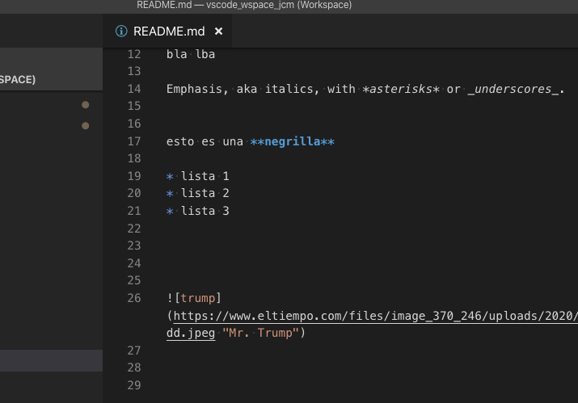

# Ejemplos de Markdown 

- [Ejemplos de Markdown](#ejemplos-de-markdown)
  - [título segundo nivel](#t%C3%ADtulo-segundo-nivel)
  - [otro](#otro)
  - [Ejemplos de imágenes](#ejemplos-de-im%C3%A1genes)
  - [Código fuente](#c%C3%B3digo-fuente)
  - [Tablas](#tablas)
  - [Links](#links)
  - [emojis](#emojis)

mi ejemplo

## título segundo nivel

bla bla lba

## otro 

bla lba

Emphasis, aka italics, with *asterisks* or _underscores_.


esto es una **negrilla**

* lista 1
* lista 2
* lista 3


## Ejemplos de imágenes 

Imagen en repositorio local:

```

```


```

```


Redimensionar (Error):
```


```


Redimensionar imagen con html:

```html

```


```html

```


```html

```


Imagen desde servidor remoto:

```

```


## Código fuente

General

```
if (isAwesome){
  return true
}
```

Sql

```sql
select * from mi_tabla
```

Json:

```json
{
  "type": "FeatureCollection", 
  "features": [
    {
      "type": "Feature", 
      "id": "u_terreno.1501624", 
      "geometry": {
        "type": "MultiPolygon", 
        "coordinates": [
          [
            [
              [
                -74.21473, 
                4.577656
              ], 
              [
                -74.214833, 
                4.577559
              ], 
              [
                -74.214848, 
                4.577545
              ], 
              [
                -74.214879, 
                4.577586
              ], 
              [
                -74.214889, 
                4.577599
              ], 
              [
                -74.214826, 
                4.577657
              ], 
              [
                -74.21481, 
                4.577673
              ], 
              [
                -74.2148, 
                4.577682
              ], 
              [
                -74.214771, 
                4.57771
              ], 
              [
                -74.21473, 
                4.577656
              ]
            ]
          ]
        ]
      }, 
      "geometry_name": "geom", 
      "properties": {
        "codigo": "257540102000000270006000000000", 
        "manzana_codigo": "25754010200000027", 
        "codigo_anterior": "25754010200270006000"
      }
    }
  ], 
  "totalFeatures": 1, 
  "numberMatched": 1, 
  "numberReturned": 1, 
  "timeStamp": "2020-03-06T06:12:01.778Z", 
  "crs": {
    "type": "name", 
    "properties": {
      "name": "urn:ogc:def:crs:EPSG::4686"
    }
  }
}

```

## Tablas

First Header | Second Header
------------ | -------------
Content from cell 1 | Content from cell 2
Content in the first column | Content in the second column

Markdown table generator:
https://www.tablesgenerator.com/markdown_tables

|  Esri Type |    GDAL Type    |
|:----------:|:---------------:|
| Polygon    | MULTIPOLYGON    |
| Polyline   | MULTILINESTRING |
| Point      | POINT           |
| Multipoint | MULTIPOINT      |

## Links

https://www.tablesgenerator.com/markdown_tables

## emojis

:+1: :+1: :+1: :+1: 
:flushed: :flushed: :flushed:

Emoji codes https://www.webfx.com/tools/emoji-cheat-sheet/ 