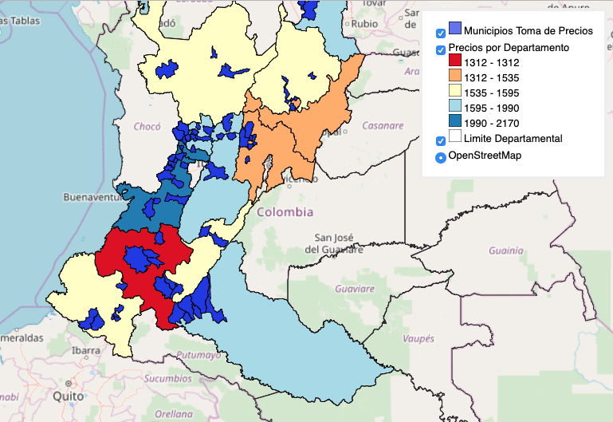

# Servicios web, geoservicios y OGC

- [Servicios web, geoservicios y OGC](#servicios-web-geoservicios-y-ogc)
  - [Tutoriales](#tutoriales)
    - [qgis2web](#qgis2web)
      - [Ejemplo](#ejemplo)
    - [GitHub Pages](#github-pages)
    - [Qgis2threejs](#qgis2threejs)

## Tutoriales

### qgis2web

* Web Mapping with QGIS2Web https://www.qgistutorials.com/en/docs/web_mapping_with_qgis2web.html
* Publica tus mapas en la web con qgis2web https://mappinggis.com/2016/03/crea-aplicaciones-webmapping-con-qgis/
* qgis2web wiki https://github.com/tomchadwin/qgis2web/wiki
  
> qgis2web es una herramienta que exporta los proyectos de QGIS en mapas web de OpenLayers o Leaflet (crea automáticamente los archivos HTML, Javascript y CSS).
> 
> qgis2web crea un mapa web basado en OpenLayers o Leaflet de todas las capas  existentes en un proyecto de QGIS. La herramienta convierte las capas vectoriales en GeoJSON y crea una estructura de carpetas con un archivo index.html que contiene el mapa web.
>
>Además el plugin es capaz de exportar la simbología definida en QGIS tanto de puntos, líneas y polígonos e incluir un control de visibilidad de capas y varios controles más.

#### Ejemplo

* Página web: https://sigfedepanela.github.io/PreciosSemanales/
* Repositorio en github: https://github.com/sigfedepanela/PreciosSemanales
* Geojson generado por la herramienta: https://raw.githubusercontent.com/sigfedepanela/PreciosSemanales/gh-pages/layers/PreciosporDepartamento_2.js

### GitHub Pages

* Getting Started with GitHub Pages https://guides.github.com/features/pages/

* Url publicado https://dersteppenwolf.github.io/cartografia_web/
  

### Qgis2threejs

* [Qgis2threejs plugin documentation](https://qgis2threejs.readthedocs.io/en/docs/)     
* [Tutorial](https://qgis2threejs.readthedocs.io/en/docs/Tutorial.html)    
 

> Qgis2threejs plugin is a QGIS plugin, which visualizes DEM data and vector data in 3D on web browsers. You can build various kinds of 3D objects with simple settings panels, view them in web view of exporter and generate files to publish them to web in simple procedure. In addition, you can save the 3D model in glTF format for 3DCG or 3D printing.
