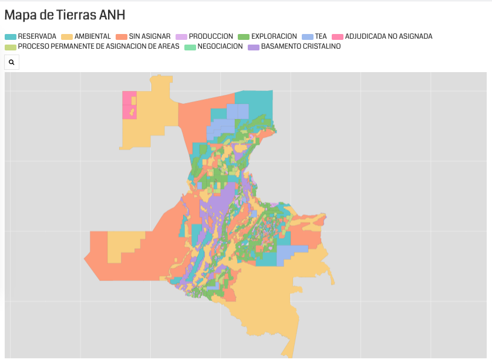

# 3 -  Cartografía
- [3 - Cartografía](#3---cartograf%C3%ADa)
  - [Presentación](#presentaci%C3%B3n)
  - [Recursos](#recursos)
    - [Tutoriales cartografía con SIG Desktop](#tutoriales-cartograf%C3%ADa-con-sig-desktop)
  - [Ejercicio 1 : Publicando mapas en la nube con Qgis Cloud](#ejercicio-1--publicando-mapas-en-la-nube-con-qgis-cloud)
  - [Ejercicio 2 : Visualizando datos con qgiscloud](#ejercicio-2--visualizando-datos-con-qgiscloud)
  - [Ejercicio 3 : Visualizando datos con Fluorish](#ejercicio-3--visualizando-datos-con-fluorish)

## Presentación

Enlace: https://github.com/dersteppenwolf/cartografia_web/blob/master/03_Cartografia/03_Cartografia.pdf

## Recursos

Cartografía Temática:

- Introduction to cartography https://www.slideshare.net/GavinMalavolta/introduction-to-cartography-geography1-14174414
- So You Want To Make A Map? https://medium.com/data-visualization-society/so-you-want-to-make-a-map-58c7f55f6b20
- Lab Thematic Web Map Design  https://github.com/dersteppenwolf/geog371/blob/master/labs/lab03/readme.md
- Intro to thematic mapping with carto https://www.slideshare.net/KristenVincent/maptime-madison-december-7th-2016?qid=09ec7af3-f23f-4dae-afc0-20aac79202c6&v=&b=&from_search=8
- Making Great Maps https://www.e-education.psu.edu/maps/l5_p2.html
- Layout and Symbolization https://www.e-education.psu.edu/maps/l5_p3.html

Vuestros mapas son feos y no sabéis por qué
-   https://geoinquietosvlc.github.io/tus_mapas_son_feos/
-   https://github.com/geoinquietosvlc/tus_mapas_son_feos
-   https://tus-mapas-son-feos.readthedocs.io/es/develop/

Colores:

- Choosing Colors, Match Colors To Your Data https://www.e-education.psu.edu/maps/l5_p5.html
- ColorBrewer: Color Advice for Maps http://colorbrewer2.org/
- d3-scale-chromatic : Sequential, diverging and categorical color scales. https://github.com/d3/d3-scale-chromatic
- Interaction of Color:  
  - > Josef Albers’s Interaction of Color is a masterwork in twentieth-century art education. Conceived as a handbook and teaching aid for artists, instructors, and students, this timeless book presents Albers’s unique ideas of color experimentation in a way that is valuable to specialists as well as to a larger audience.
  - Aplicación para iPad. http://yupnet.org/interactionofcolor/  
  - Libro http://yupnet.org/interactionofcolor/50th-anniversary-edition-paperback/ 
- Color harmony concepts: http://paletton.com/
- Colorgorical: http://vrl.cs.brown.edu/color   Generate a palette with n colors.
- Color blindness simulator https://www.color-blindness.com/coblis-color-blindness-simulator/
- Adobe color: Hace más fácil la creación y descubrimiento de temas de colores únicos y accesibles 
  - https://www.adobe.com/la/products/color.html  
  - https://color.adobe.com/es/create
- Viz-Palette: 
  - > Born out of a frustration with picking colors for data visualizations. This project is optimized for tweaking, copying, and pasting colors in and out of JavaScript.
  - https://www.susielu.com/data-viz/viz-palette
  - https://projects.susielu.com/viz-palette
- Data color picker https://learnui.design/tools/data-color-picker.html
- Accesible color generator https://learnui.design/tools/accessible-color-generator.html

Métodos de clasificación:

- Data Classification https://www.e-education.psu.edu/maps/l5_p6.html 
- Geospatial Analysis : Classification and clustering http://www.spatialanalysisonline.com/HTML/index.html?classification_and_clustering.htm
- Data classification methods https://pro.arcgis.com/en/pro-app/help/mapping/layer-properties/data-classification-methods.htm

Normalización de datos:

- Normalization, Mapping Rates, Not Totals https://www.e-education.psu.edu/maps/l4_p5.html
- CV-05 - Statistical Mapping (Enumeration, Normalization, Classification) https://gistbok.ucgis.org/bok-topics/statistical-mapping-enumeration-normalization-classification
- Mapping with Aggregated Statistics http://www.pbcgis.com/normalize/

Otros:
- Recomendaciones cartografía símbolos proporcionales https://twitter.com/ramiroaznar/status/1245323283756613632?s=03
- Visualize 2015 Urban Populations with Proportional Symbols https://carto.com/blog/proportional-symbol-maps/
- Recomendaciones mapas coropletas https://twitter.com/ramiroaznar/status/1242693988680859650
- Data Mountains: Visualizing Bivariate Maps in a Different Way https://carto.com/blog/data-mountains/

### Tutoriales cartografía con SIG Desktop

- Thematic Maps using arcgis http://what-when-how.com/gis-and-spatial-analysis-for-the-social-sciences/thematic-maps-gis-and-spatial-analysis-part-1/
- Elements of a map https://www.gislounge.com/whats-in-a-map/
- Cartographic Tips For Creating Beautiful Maps With ArcMap https://alexurquhart.com/post/cartography-tips-arcmap/

## Ejercicio 1 : Publicando mapas en la nube con Qgis Cloud

QGIS Cloud  es un servicio en la nube Web-GIS que permite publicar mapas, datos y servicios en Internet desde Qgis Desktop.

Realizar lo siguiente: 

- Cree una cuenta gratuita en Qgis Cloud https://qgiscloud.com/
- Instale el plugin de Qgis Cloud https://plugins.qgis.org/plugins/qgiscloud/
- Publique mapas en Qgis Cloud desde Qgis 
  - Quickstart https://qgiscloud.com/pages/quickstart
  - Cómo publicar mapas online con QGIS Cloud https://mappinggis.com/2019/01/como-publicar-mapas-con-qgis/

## Ejercicio 2 : Visualizando datos con qgiscloud

**QGIS Cloud** https://qgiscloud.com/ es un servicio en la nube para publicar mapas, datos y servicios en Internet de forma sencilla.

A través del plugin para QGIS **QGIS Cloud Plugin** es posible publicar un proyecto (mapa) creado con QGIS en el servicio web de **QGIS Cloud** 

- Quickstart https://www.qgiscloud.com/en/pages/quickstart
- Tutorial: Cómo publicar mapas online con QGIS Cloud  https://mappinggis.com/2019/01/como-publicar-mapas-con-qgis/

## Ejercicio 3 : Visualizando datos con Fluorish

**Fluorish**  https://flourish.studio/ es una aplicación web para  visualización de datos que permite crear fácilmente gráficos interactivos. 

**Ejemplo:** Mapa de tierras ANH
https://public.flourish.studio/visualisation/1778269/

Más información:

- Herramienta para periodistas: Flourish, para crear visualizaciones de datos sin conocimientos de programación https://www.fopea.org/herramienta-para-periodistas-flourish-para-crear-visualizaciones-de-datos-sin-conocimientos-de-programacion/
- Aprende a crear gráficos utilizando Flourish Studio para enganchar a tu audiencia https://consejoderedaccion.org/cdrlab/herramientas/item/772-flourish-studio-para-enganchar-usando-datos
- Flourish: Data Visualization and storytelling, No coding required  https://neogeografia.wordpress.com/2018/09/26/flourish-data-visualization-and-storytelling-no-coding-required/
- You can now make data-driven maps using custom boundaries, without coding https://flourish.studio/2018/10/23/make-your-own-data-driven-maps/
- Make interactive maps without coding.  Easily create stunning interactive maps with Flourish, the platform for data visualization and storytelling https://flourish.studio/visualisations/maps/
