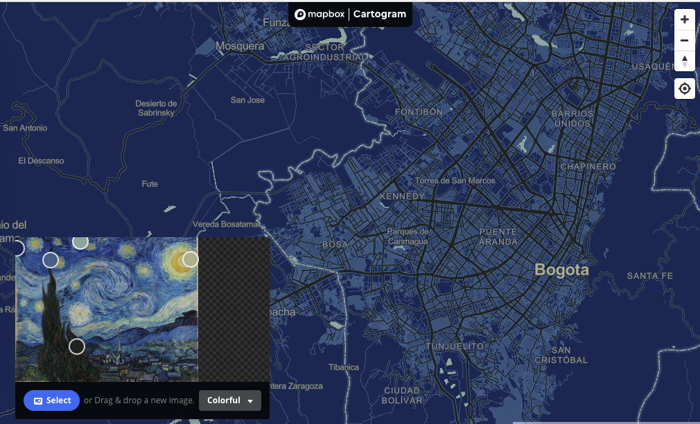
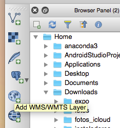
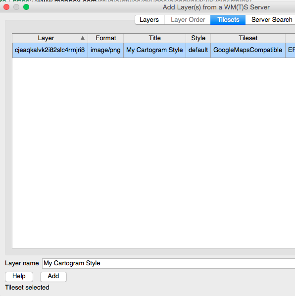

# Servidores de mapas

- [Servidores de mapas](#servidores-de-mapas)
  - [Presentación](#presentaci%C3%B3n)
  - [Ejercicio 1: Crear y publicar mapa base simple con mapbox utilizando Cartogram](#ejercicio-1-crear-y-publicar-mapa-base-simple-con-mapbox-utilizando-cartogram)
  - [Ejercicio 2: Crear, modificar y publicar mapas base con mapbox](#ejercicio-2-crear-modificar-y-publicar-mapas-base-con-mapbox)
  - [Ejercicio 3: Publicar datos en Postgis Utilizando QGIS](#ejercicio-3-publicar-datos-en-postgis-utilizando-qgis)
  - [Ejercicio 4: Consultando datos de Postgis con Dbeaver](#ejercicio-4-consultando-datos-de-postgis-con-dbeaver)
  - [Ejercicio 5: Publicando servicios WMS, WMTS y WFS en Geoserver](#ejercicio-5-publicando-servicios-wms-wmts-y-wfs-en-geoserver)
  - [Ejercicio 6: Consumiendo servicios WCS](#ejercicio-6-consumiendo-servicios-wcs)

## Presentación

Enlace https://github.com/dersteppenwolf/cartografia_web/blob/master/05_Servidores_Mapas/05_Servidores_de_Mapas.pdf

## Ejercicio 1: Crear y publicar mapa base simple con mapbox utilizando Cartogram

Realizar lo siguiente: 

- Cree una cuenta en mapbox https://www.mapbox.com/
- Cree un Mapa base con Cartogram https://apps.mapbox.com/cartogram/#13.01/40.7251/-74.0051

> Cartogram: "instantly make a map from a photo."

**Imagen de Ejemplo:**

Resultado:

Utilizar Estilo

Ejemplo:

https://api.mapbox.com/styles/v1/gkudos/cjeaqkalvk2i82slc4rrnjri8.html?fresh=true&title=true&access_token=pk.eyJ1IjoiZ2t1ZG9zIiwiYSI6IkJ6Snd0WVUifQ.KkZKDrLUGoAuDv8CfLg4xg#13.0/40.720538/-73.997072/0

**Ejemplo de uso con mapbox gl:**

https://bl.ocks.org/dersteppenwolf/cd1c72c482ed72cfcf8156ad65ef3e26

**Ejemplo de uso con leaflet:**

https://bl.ocks.org/dersteppenwolf/e87dccd027e28208ca955047b08b2537

**Consuma el mapa como WMTS con Qgis y Arcgis**

- Add Mapbox maps as layers in ArcGIS and QGIS with WMTS https://docs.mapbox.com/help/tutorials/mapbox-arcgis-qgis/
- Is it possible to use WMTS in QGIS? https://gis.stackexchange.com/questions/52346/is-it-possible-to-use-wmts-in-qgis

**Ejemplo de uso en QGIS con WMTS**

Personalizar estilos con Mapbox studio: 

## Ejercicio 2: Crear, modificar y publicar mapas base   con mapbox

Realizar lo siguiente: 

- Cree un mapa base en mapbox siguiendo el siguiente tutorial
  - Mapbox Create a custom style https://docs.mapbox.com/help/tutorials/create-a-custom-style/
- Publique el mapa creado y consúmalo en QGIS como WMTS https://docs.mapbox.com/studio-manual/overview/publish-your-style/
- Consuma el mapa base utilizando Mapbox.js / Leaflet. Ejemplo https://docs.mapbox.com/mapbox.js/example/v1.0.0/stylelayer/
- Tutorial Base Map Design using Mapbox https://github.com/dersteppenwolf/geog371/tree/master/lectures/lec13

## Ejercicio 3: Publicar datos en Postgis Utilizando QGIS

Realizar lo siguiente: 

- Cargar datos geográficos en postgresql / postgis utilizando qgis.
- Utilice el servidor de base de datos en la nube asignado en la clase.
- Loading data into PostgreSQL from QGIS https://astuntech.atlassian.net/wiki/spaces/ISHAREHELP/pages/137390054/Loading+data+into+PostgreSQL+from+QGIS
- Nota: Al nombre de la capa asígnele su prefijo asignado según la lista de clase. Ejemplo: u1_departamentos

## Ejercicio 4: Consultando datos de Postgis con Dbeaver 

Realizar lo siguiente: 
- Instale Dbeaver community https://dbeaver.io/
- Cree una conexión al servidor postgresql  asignado para la clase https://github.com/dbeaver/dbeaver/wiki/Create-Connection
- Realice consultas sql
- Previsualice las geometrías con Dbeaver https://dbeaver.com/docs/wiki/Working-with-Spatial-GIS-data/
- 

## Ejercicio 5: Publicando servicios WMS, WMTS y WFS en Geoserver

Realizar lo siguiente: 

- Publicar servicios WMS y WFS en geoserver a partir de los datos cargados en el paso anterior.
- Utilice el servidor geoserver en la nube asignado en la clase.
- Publishing a PostGIS table https://docs.geoserver.org/stable/en/user/gettingstarted/postgis-quickstart/index.html
- Nota: Al nombre de la capa publicada asígnele su prefijo asignado según la lista de clase. Ejemplo: u1_departamentos_layer
  
## Ejercicio 6: Consumiendo servicios WCS

Realizar lo siguiente: 

- Cargue datos provenientes de servicios WCS en QGIS https://docs.qgis.org/3.4/en/docs/user_manual/working_with_ogc/ogc_client_support.html#wcs-client
- Servidor Geoserver Clase http://34.83.176.208:18080/geoserver/ows?service=WCS&version=2.0.1&request=GetCapabilities

