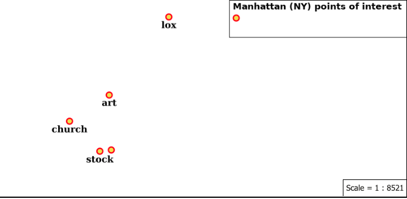
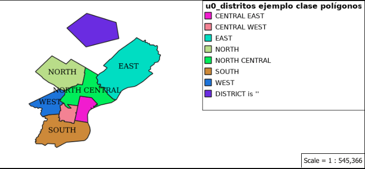
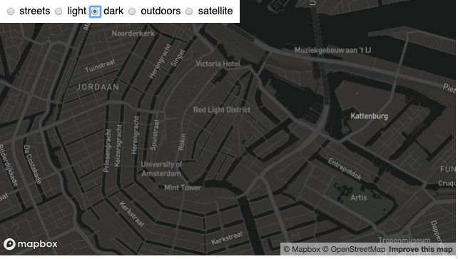
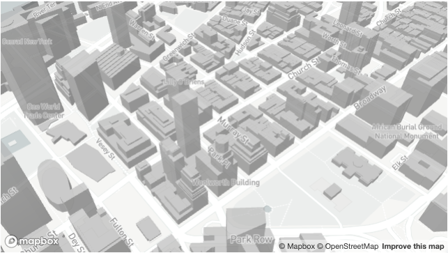
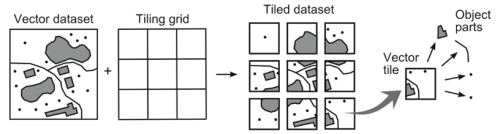
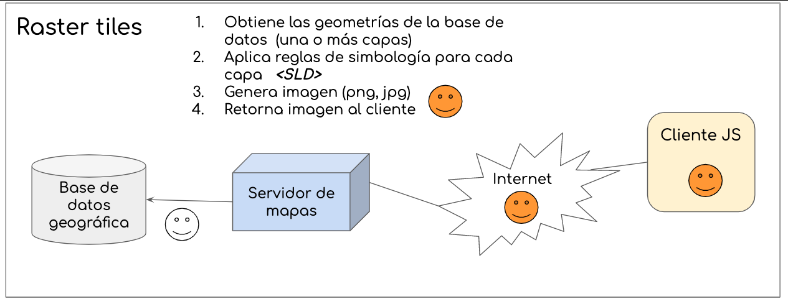
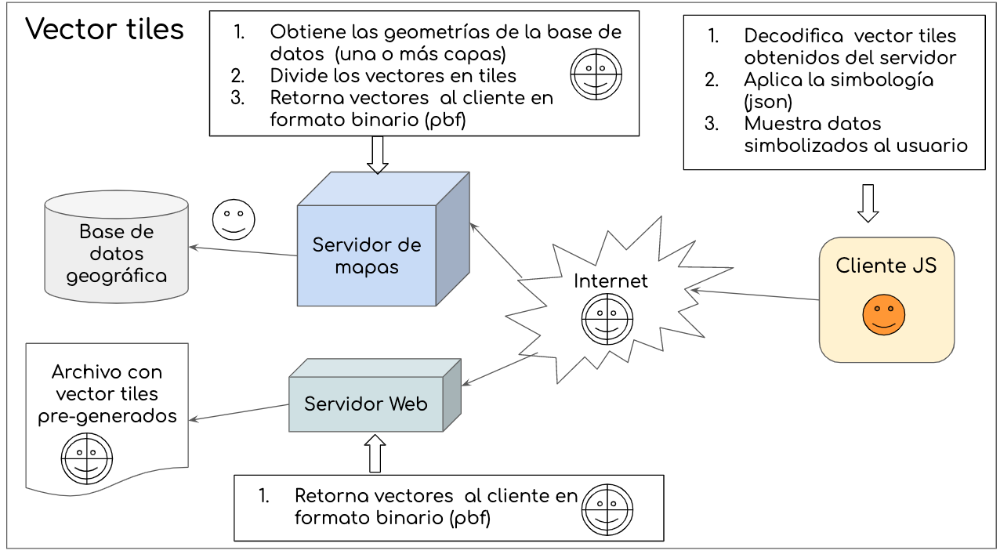

# Simbología para Mapas Web

- [Simbología para Mapas Web](#simbolog%C3%ADa-para-mapas-web)
  - [SLD (Styled Layer Descriptor )](#sld-styled-layer-descriptor)
    - [Ejemplo simbología SLD para geometría de tipo línea](#ejemplo-simbolog%C3%ADa-sld-para-geometr%C3%ADa-de-tipo-l%C3%ADnea)
    - [Ejemplo simbología SLD para geometría de tipo punto con etiquetado](#ejemplo-simbolog%C3%ADa-sld-para-geometr%C3%ADa-de-tipo-punto-con-etiquetado)
    - [Ejemplo simbología SLD para geometría de tipo polígono clasificada por un atributo](#ejemplo-simbolog%C3%ADa-sld-para-geometr%C3%ADa-de-tipo-pol%C3%ADgono-clasificada-por-un-atributo)
    - [Ejemplo simbología SLD para ráster](#ejemplo-simbolog%C3%ADa-sld-para-r%C3%A1ster)
  - [Implementaciones de SLD](#implementaciones-de-sld)
    - [Geoserver](#geoserver)
    - [Mapserver](#mapserver)
    - [Arcgis Server](#arcgis-server)
  - [Simbología en Geoserver](#simbolog%C3%ADa-en-geoserver)
    - [SLD](#sld)
      - [Generando SLD's con QGIS](#generando-slds-con-qgis)
      - [SLD Avanzado](#sld-avanzado)
    - [Otros lenguajes para construcción de simbología para Geoserver](#otros-lenguajes-para-construcci%C3%B3n-de-simbolog%C3%ADa-para-geoserver)
      - [YSLD](#ysld)
      - [CSS](#css)
      - [MBStyle](#mbstyle)
    - [Leyendas en geoserver](#leyendas-en-geoserver)
  - [Avances "recientes" para simbología en la web: Vector tiles](#avances-%22recientes%22-para-simbolog%C3%ADa-en-la-web-vector-tiles)
    - [Qué son los vector tiles?](#qu%C3%A9-son-los-vector-tiles)
    - [Comparación proceso de generación Raster tiles vs Vector tiles](#comparaci%C3%B3n-proceso-de-generaci%C3%B3n-raster-tiles-vs-vector-tiles)
    - [Simbología para vector tiles](#simbolog%C3%ADa-para-vector-tiles)
    - [Diferencias entre teselas raster y vector](#diferencias-entre-teselas-raster-y-vector)
    - [Documentación técnica sobre Vector Tiles](#documentaci%C3%B3n-t%C3%A9cnica-sobre-vector-tiles)
  - [Otros](#otros)

## SLD (Styled Layer Descriptor )

Styled Layer Descriptor https://www.opengeospatial.org/standards/sld

    The OpenGIS® Styled Layer Descriptor (SLD) Profile of the OpenGIS® Web Map Service (WMS)
    Encoding Standard [http://www.opengeospatial.org/standards/wms] defines
    an encoding that extends
     the WMS standard to allow user-defined symbolization
    and coloring of geographic feature[http://www.opengeospatial.org/ogc/glossary/f]
    and coverage[http://www.opengeospatial.org/ogc/glossary/c] data.

https://en.wikipedia.org/wiki/Styled_Layer_Descriptor

    In cartography, a Styled Layer Descriptor (SLD) is an XML
    schema specified by the Open Geospatial Consortium (OGC)
    for describing the appearance of map layers.
    It is capable of describing the rendering of vector and raster data.
    A typical use of SLDs is to instruct a Web Map Service (WMS)
    how to render a specific layer.

### Ejemplo simbología SLD para geometría de tipo línea

```xml
<?xml version="1.0" encoding="UTF-8"?>
<StyledLayerDescriptor version="1.1.0"
  xmlns="http://www.opengis.net/sld"
  xmlns:se="http://www.opengis.net/se"
  xmlns:ogc="http://www.opengis.net/ogc"
  xmlns:xlink="http://www.w3.org/1999/xlink"
  xmlns:xsi="http://www.w3.org/2001/XMLSchema-instance"
  xsi:schemaLocation="http://www.opengis.net/sld
  http://schemas.opengis.net/sld/1.1.0/StyledLayerDescriptor.xsd">
<NamedLayer>
  <se:Name>country_bounds</se:Name>
    <UserStyle>
      <se:Name>xxx</se:Name>
      <se:FeatureTypeStyle>
        <se:Rule>
          <se:LineSymbolizer>
            <se:Geometry>
              <ogc:PropertyName>center-line</ogc:PropertyName>
            </se:Geometry>
            <se:Stroke>
              <se:SvgParameter name="stroke">#0000ff</se:SvgParameter>
            </se:Stroke>
          </se:LineSymbolizer>
        </se:Rule>
      </se:FeatureTypeStyle>
    </UserStyle>
  </NamedLayer>
</StyledLayerDescriptor>
```


### Ejemplo simbología SLD para geometría de tipo punto con etiquetado

```xml
<?xml version="1.0" encoding="UTF-8"?>
<StyledLayerDescriptor version="1.0.0" xmlns="http://www.opengis.net/sld" xmlns:ogc="http://www.opengis.net/ogc"
  xmlns:xlink="http://www.w3.org/1999/xlink" xmlns:xsi="http://www.w3.org/2001/XMLSchema-instance"
  xsi:schemaLocation="http://www.opengis.net/sld http://schemas.opengis.net/sld/1.0.0/StyledLayerDescriptor.xsd">
  <NamedLayer>
    <Name>poi</Name>
    <UserStyle>
      <Name>poi</Name>
      <Title>Points of interest</Title>
      <Abstract>Manhattan points of interest</Abstract>
      <FeatureTypeStyle>
        <Rule>
          <PointSymbolizer>
            <Graphic>
              <Mark>
                <WellKnownName>circle</WellKnownName>
                <Fill>
                  <CssParameter name="fill">#FF0000</CssParameter>
                  <CssParameter name="fill-opacity">1.0</CssParameter>
                </Fill>
              </Mark>
              <Size>11</Size>
            </Graphic>
          </PointSymbolizer>
          <PointSymbolizer>
            <Graphic>
              <Mark>
                <WellKnownName>circle</WellKnownName>
                <Fill>
                  <CssParameter name="fill">#EDE513</CssParameter>
                  <CssParameter name="fill-opacity">1.0</CssParameter>
                </Fill>
              </Mark>
              <Size>7</Size>
            </Graphic>
          </PointSymbolizer>
        </Rule>
        <Rule>
          <MaxScaleDenominator>32000</MaxScaleDenominator>
          <TextSymbolizer>
            <Label>
              <ogc:PropertyName>NAME</ogc:PropertyName>
            </Label>
            <Font>
              <CssParameter name="font-family">Arial</CssParameter>
              <CssParameter name="font-weight">Bold</CssParameter>
              <CssParameter name="font-size">14</CssParameter>
            </Font>
            <LabelPlacement>
              <PointPlacement>
                <AnchorPoint>
                  <AnchorPointX>0.5</AnchorPointX>
                  <AnchorPointY>0.5</AnchorPointY>
                </AnchorPoint>
                <Displacement>
                  <DisplacementX>0</DisplacementX>
                  <DisplacementY>-15</DisplacementY>
                </Displacement>
              </PointPlacement>
            </LabelPlacement>
            <Halo>
              <Radius>
                <ogc:Literal>2</ogc:Literal>
              </Radius>
              <Fill>
                <CssParameter name="fill">#FFFFFF</CssParameter>
              </Fill>
            </Halo>
            <Fill>
              <CssParameter name="fill">#000000</CssParameter>
            </Fill>
          </TextSymbolizer>
        </Rule>
      </FeatureTypeStyle>
    </UserStyle>
  </NamedLayer>
</StyledLayerDescriptor>


```

Vista:




### Ejemplo simbología SLD para geometría de tipo polígono clasificada por un atributo

```xml
<?xml version="1.0" encoding="UTF-8"?>
<StyledLayerDescriptor xmlns="http://www.opengis.net/sld" xmlns:ogc="http://www.opengis.net/ogc" xmlns:se="http://www.opengis.net/se" version="1.1.0" xsi:schemaLocation="http://www.opengis.net/sld http://schemas.opengis.net/sld/1.1.0/StyledLayerDescriptor.xsd" xmlns:xlink="http://www.w3.org/1999/xlink" xmlns:xsi="http://www.w3.org/2001/XMLSchema-instance">
  <NamedLayer>
    <se:Name>u0_distritos ejemplo clase polígonos</se:Name>
    <UserStyle>
      <se:Name>u0_distritos ejemplo clase polígonos</se:Name>
      <se:FeatureTypeStyle>
        <se:Rule>
          <se:Name>CENTRAL EAST</se:Name>
          <se:Description>
            <se:Title>CENTRAL EAST</se:Title>
          </se:Description>
          <ogc:Filter xmlns:ogc="http://www.opengis.net/ogc">
            <ogc:PropertyIsEqualTo>
              <ogc:PropertyName>DISTRICT</ogc:PropertyName>
              <ogc:Literal>CENTRAL EAST</ogc:Literal>
            </ogc:PropertyIsEqualTo>
          </ogc:Filter>
          <se:PolygonSymbolizer>
            <se:Fill>
              <se:SvgParameter name="fill">#ec14d7</se:SvgParameter>
            </se:Fill>
            <se:Stroke>
              <se:SvgParameter name="stroke">#232323</se:SvgParameter>
              <se:SvgParameter name="stroke-width">1</se:SvgParameter>
              <se:SvgParameter name="stroke-linejoin">bevel</se:SvgParameter>
            </se:Stroke>
          </se:PolygonSymbolizer>
        </se:Rule>
        <se:Rule>
          <se:Name>CENTRAL WEST</se:Name>
          <se:Description>
            <se:Title>CENTRAL WEST</se:Title>
          </se:Description>
          <ogc:Filter xmlns:ogc="http://www.opengis.net/ogc">
            <ogc:PropertyIsEqualTo>
              <ogc:PropertyName>DISTRICT</ogc:PropertyName>
              <ogc:Literal>CENTRAL WEST</ogc:Literal>
            </ogc:PropertyIsEqualTo>
          </ogc:Filter>
          <se:PolygonSymbolizer>
            <se:Fill>
              <se:SvgParameter name="fill">#ef8393</se:SvgParameter>
            </se:Fill>
            <se:Stroke>
              <se:SvgParameter name="stroke">#232323</se:SvgParameter>
              <se:SvgParameter name="stroke-width">1</se:SvgParameter>
              <se:SvgParameter name="stroke-linejoin">bevel</se:SvgParameter>
            </se:Stroke>
          </se:PolygonSymbolizer>
        </se:Rule>
        <se:Rule>
          <se:Name>EAST</se:Name>
          <se:Description>
            <se:Title>EAST</se:Title>
          </se:Description>
          <ogc:Filter xmlns:ogc="http://www.opengis.net/ogc">
            <ogc:PropertyIsEqualTo>
              <ogc:PropertyName>DISTRICT</ogc:PropertyName>
              <ogc:Literal>EAST</ogc:Literal>
            </ogc:PropertyIsEqualTo>
          </ogc:Filter>
          <se:PolygonSymbolizer>
            <se:Fill>
              <se:SvgParameter name="fill">#19ddc0</se:SvgParameter>
            </se:Fill>
            <se:Stroke>
              <se:SvgParameter name="stroke">#232323</se:SvgParameter>
              <se:SvgParameter name="stroke-width">1</se:SvgParameter>
              <se:SvgParameter name="stroke-linejoin">bevel</se:SvgParameter>
            </se:Stroke>
          </se:PolygonSymbolizer>
        </se:Rule>
        <se:Rule>
          <se:Name>NORTH</se:Name>
          <se:Description>
            <se:Title>NORTH</se:Title>
          </se:Description>
          <ogc:Filter xmlns:ogc="http://www.opengis.net/ogc">
            <ogc:PropertyIsEqualTo>
              <ogc:PropertyName>DISTRICT</ogc:PropertyName>
              <ogc:Literal>NORTH</ogc:Literal>
            </ogc:PropertyIsEqualTo>
          </ogc:Filter>
          <se:PolygonSymbolizer>
            <se:Fill>
              <se:SvgParameter name="fill">#bbde7d</se:SvgParameter>
            </se:Fill>
            <se:Stroke>
              <se:SvgParameter name="stroke">#232323</se:SvgParameter>
              <se:SvgParameter name="stroke-width">1</se:SvgParameter>
              <se:SvgParameter name="stroke-linejoin">bevel</se:SvgParameter>
            </se:Stroke>
          </se:PolygonSymbolizer>
        </se:Rule>
        <se:Rule>
          <se:Name>NORTH CENTRAL</se:Name>
          <se:Description>
            <se:Title>NORTH CENTRAL</se:Title>
          </se:Description>
          <ogc:Filter xmlns:ogc="http://www.opengis.net/ogc">
            <ogc:PropertyIsEqualTo>
              <ogc:PropertyName>DISTRICT</ogc:PropertyName>
              <ogc:Literal>NORTH CENTRAL</ogc:Literal>
            </ogc:PropertyIsEqualTo>
          </ogc:Filter>
          <se:PolygonSymbolizer>
            <se:Fill>
              <se:SvgParameter name="fill">#1eee33</se:SvgParameter>
            </se:Fill>
            <se:Stroke>
              <se:SvgParameter name="stroke">#232323</se:SvgParameter>
              <se:SvgParameter name="stroke-width">1</se:SvgParameter>
              <se:SvgParameter name="stroke-linejoin">bevel</se:SvgParameter>
            </se:Stroke>
          </se:PolygonSymbolizer>
        </se:Rule>
        <se:Rule>
          <se:Name>SOUTH</se:Name>
          <se:Description>
            <se:Title>SOUTH</se:Title>
          </se:Description>
          <ogc:Filter xmlns:ogc="http://www.opengis.net/ogc">
            <ogc:PropertyIsEqualTo>
              <ogc:PropertyName>DISTRICT</ogc:PropertyName>
              <ogc:Literal>SOUTH</ogc:Literal>
            </ogc:PropertyIsEqualTo>
          </ogc:Filter>
          <se:PolygonSymbolizer>
            <se:Fill>
              <se:SvgParameter name="fill">#ca8a22</se:SvgParameter>
            </se:Fill>
            <se:Stroke>
              <se:SvgParameter name="stroke">#232323</se:SvgParameter>
              <se:SvgParameter name="stroke-width">1</se:SvgParameter>
              <se:SvgParameter name="stroke-linejoin">bevel</se:SvgParameter>
            </se:Stroke>
          </se:PolygonSymbolizer>
        </se:Rule>
        <se:Rule>
          <se:Name>WEST</se:Name>
          <se:Description>
            <se:Title>WEST</se:Title>
          </se:Description>
          <ogc:Filter xmlns:ogc="http://www.opengis.net/ogc">
            <ogc:PropertyIsEqualTo>
              <ogc:PropertyName>DISTRICT</ogc:PropertyName>
              <ogc:Literal>WEST</ogc:Literal>
            </ogc:PropertyIsEqualTo>
          </ogc:Filter>
          <se:PolygonSymbolizer>
            <se:Fill>
              <se:SvgParameter name="fill">#2571e2</se:SvgParameter>
            </se:Fill>
            <se:Stroke>
              <se:SvgParameter name="stroke">#232323</se:SvgParameter>
              <se:SvgParameter name="stroke-width">1</se:SvgParameter>
              <se:SvgParameter name="stroke-linejoin">bevel</se:SvgParameter>
            </se:Stroke>
          </se:PolygonSymbolizer>
        </se:Rule>
        <se:Rule>
          <se:Name></se:Name>
          <se:Description>
            <se:Title>DISTRICT is ''</se:Title>
          </se:Description>
          <ogc:Filter xmlns:ogc="http://www.opengis.net/ogc">
            <ogc:Or>
              <ogc:PropertyIsEqualTo>
                <ogc:PropertyName>DISTRICT</ogc:PropertyName>
                <ogc:Literal></ogc:Literal>
              </ogc:PropertyIsEqualTo>
              <ogc:PropertyIsNull>
                <ogc:PropertyName>DISTRICT</ogc:PropertyName>
              </ogc:PropertyIsNull>
            </ogc:Or>
          </ogc:Filter>
          <se:PolygonSymbolizer>
            <se:Fill>
              <se:SvgParameter name="fill">#6720eb</se:SvgParameter>
            </se:Fill>
            <se:Stroke>
              <se:SvgParameter name="stroke">#232323</se:SvgParameter>
              <se:SvgParameter name="stroke-width">1</se:SvgParameter>
              <se:SvgParameter name="stroke-linejoin">bevel</se:SvgParameter>
            </se:Stroke>
          </se:PolygonSymbolizer>
        </se:Rule>
        <se:Rule>
          <se:TextSymbolizer>
            <se:Label>
              <ogc:PropertyName>DISTRICT</ogc:PropertyName>
            </se:Label>
            <se:Font>
              <se:SvgParameter name="font-family">.AppleSystemUIFont</se:SvgParameter>
              <se:SvgParameter name="font-size">13</se:SvgParameter>
            </se:Font>
            <se:LabelPlacement>
              <se:PointPlacement>
                <se:AnchorPoint>
                  <se:AnchorPointX>0</se:AnchorPointX>
                  <se:AnchorPointY>0.5</se:AnchorPointY>
                </se:AnchorPoint>
              </se:PointPlacement>
            </se:LabelPlacement>
            <se:Fill>
              <se:SvgParameter name="fill">#000000</se:SvgParameter>
            </se:Fill>
            <se:VendorOption name="maxDisplacement">1</se:VendorOption>
          </se:TextSymbolizer>
        </se:Rule>
      </se:FeatureTypeStyle>
    </UserStyle>
  </NamedLayer>
</StyledLayerDescriptor>


```

Vista:




### Ejemplo simbología SLD para ráster

```xml
<?xml version="1.0" encoding="ISO-8859-1"?>
<StyledLayerDescriptor version="1.0.0" 
    xsi:schemaLocation="http://www.opengis.net/sld StyledLayerDescriptor.xsd" 
    xmlns="http://www.opengis.net/sld" 
    xmlns:ogc="http://www.opengis.net/ogc" 
    xmlns:xlink="http://www.w3.org/1999/xlink" 
    xmlns:xsi="http://www.w3.org/2001/XMLSchema-instance">
  <NamedLayer>
    <Name>Two color gradient</Name>
    <UserStyle>
      <Title>SLD Cook Book: Two color gradient</Title>
      <FeatureTypeStyle>
        <Rule>
          <RasterSymbolizer>
            <ColorMap>
              <ColorMapEntry color="#008000" quantity="70" />
              <ColorMapEntry color="#663333" quantity="256" />
            </ColorMap>
          </RasterSymbolizer>
        </Rule>
      </FeatureTypeStyle>
    </UserStyle>
  </NamedLayer>
</StyledLayerDescriptor>
```
>  Each entry in the <ColorMap> represents one entry or anchor in the gradient. Line 5 sets the lower value of 70 via the quantity parameter, which is styled a dark green (#008000). Line 6 sets the upper value of 256 via the quantity parameter again, which is styled a dark brown (#663333). All data values in between these two quantities will be linearly interpolated: a value of 163 (the midpoint between 70 and 256) will be colored as the midpoint between the two colors (in this case approximately #335717, a muddy green).

## Implementaciones de SLD

### Geoserver

SLD Cookbook https://docs.geoserver.org/stable/en/user/styling/sld/cookbook/

### Mapserver

SLD https://mapserver.org/ogc/sld.html

### Arcgis Server

- Utilizar descriptores de capa con estilo con servicios WMS https://enterprise.arcgis.com/es/server/latest/publish-services/windows/using-styled-layer-descriptors-with-wms-services.htm

```xml
<sld:StyledLayerDescriptor version="1.0.0" xsi:schemaLocation="http://www.opengis.net/sld http://schemas.opengis.net/sld/1.0.0/StyledLayerDescriptor.xsd">
 <!--
  ESRI_StatesCitiesRivers_USA @
  http://sampleserver1.arcgisonline.com/arcgis/services/Specialty/ESRI_StatesCitiesRivers_USA/MapServer/WMSServer?
 -->
 <sld:NamedLayer>
  <!--
   layer "2" is the "cities" point layer in the WMS service
  -->
  <sld:Name>2</sld:Name>
  <sld:UserStyle>
   <!--
    style should be applied on layer "2", reference the style by it's name "pointSymbolizer"
   -->
   <sld:Name>pointSymbolizer</sld:Name>
   <sld:Title>pointSymbolizer</sld:Title>
   <sld:FeatureTypeStyle>
    <sld:Rule>
     <sld:PointSymbolizer>
      <sld:Graphic>
       <sld:Mark>
        <!-- uses a circle to mark a city -->
        <sld:WellKnownName>circle</sld:WellKnownName>
        <!-- fill circle with color #666666 -->
        <sld:Fill>
         <sld:CssParameter name="fill">#666666</sld:CssParameter>
         <sld:CssParameter name="fill-opacity">1</sld:CssParameter>
        </sld:Fill>
        <!-- circle boundary with color #666666 -->
        <sld:Stroke>
         <sld:CssParameter name="stroke">#666666</sld:CssParameter>
         <sld:CssParameter name="stroke-opacity">1</sld:CssParameter>
         <sld:CssParameter name="stroke-width">1</sld:CssParameter>
        </sld:Stroke>
       </sld:Mark>
       <!-- circle opacity 1.0 -->
       <sld:Opacity>1</sld:Opacity>
       <!-- circle size "3" -->
       <sld:Size>3</sld:Size>
       <sld:Rotation>0</sld:Rotation>
      </sld:Graphic>
     </sld:PointSymbolizer>
    </sld:Rule>
   </sld:FeatureTypeStyle>
  </sld:UserStyle>
 </sld:NamedLayer>
</sld:StyledLayerDescriptor>
```

- Muestras del Descriptor de capa con estilo (SLD) de WMS https://enterprise.arcgis.com/es/server/latest/publish-services/windows/wms-styled-layer-descriptor-sld-samples.htm

##  Simbología en Geoserver

- Geoserver Styling https://docs.geoserver.org/stable/en/user/styling/index.html

### SLD

- SLD Styling https://docs.geoserver.org/latest/en/user/styling/sld/index.html
- SLD Reference https://docs.geoserver.org/latest/en/user/styling/sld/reference/index.html
- SLD Extensions in GeoServer https://docs.geoserver.org/latest/en/user/styling/sld/extensions/index.html

#### Generando SLD's con QGIS

- Generating SLD styles with QGIS https://docs.geoserver.org/stable/en/user/styling/qgis/index.html
- Cómo crear estilos SLD con QGIS para GeoServer https://mappinggis.com/2019/04/como-crear-estilos-sld-con-qgis-para-geoserver/

#### SLD Avanzado

- Geoserver: Optimize Styling https://es.slideshare.net/geosolutions/geoserver-on-steroids/35
- Creating Stunning Maps in GeoServer: mastering SLD and CSS styles https://es.slideshare.net/geosolutions/creating-stunning-maps-in-geoserver-mastering-sld-and-css-styles-foss4g-2016
- Advanced Cartographic Map Rendering in GeoServer https://es.slideshare.net/geosolutions/advanced-cartographic-map-rendering-in-geoserver-50703958


### Otros lenguajes para construcción de simbología para Geoserver

#### YSLD

YSLD is a YAML based language 
(Qué es YAML? https://fercontreras.com/conoce-que-es-un-yaml-e18e9d21ade4 )

- YSLD Styling https://docs.geoserver.org/stable/en/user/styling/ysld/index.html
- YSLD Styling Workbook https://docs.geoserver.org/stable/en/user/styling/workshop/ysld/index.html

Ejemplo geometría punto:

```yml
title: 'YSLD Cook Book: Simple Point'
feature-styles:
- name: name
  rules:
  - symbolizers:
    - point:
        size: 6
        symbols:
        - mark:
            shape: circle
            fill-color: '#FF0000'
```

#### CSS 

- CSS styling https://docs.geoserver.org/stable/en/user/styling/css/index.html
- CSS Styling Workbook https://docs.geoserver.org/stable/en/user/styling/workshop/css/index.html

Ejemplo geometría punto:

```css
 * {
   mark: symbol(circle);
   mark-size: 6px;
   :mark {
     fill: red;
   }
 }
 ```

 Ejemplo polígono con etiquetado:

```css
 /* @title Manzana */
* {
    [@sd > 200] [@sd < 30k]   {
      stroke: #E5E8E8 ;
      stroke-width: 1;
      stroke-opacity:1;      
      fill: #F7F9F9 ; 
      fill-opacity: 0.4;
  }
}
[@sd > 1k ] [@sd < 3k] {
  stroke: black;
  stroke-width: 0.2;
  label:[strSubstring(codigo, 13, 17) ];
  label-anchor: 0.5 0.5;
  label-max-displacement: 10;
  label-allow-overruns: true;
  font-family: "DejaVu Sans";
  font-fill: black;
  font-style: normal;
  font-weight: normal;
  font-size: 10;
  halo-color: #ffffff;
  halo-radius: 1;
}
```

SLD equivalente para el polígono con etiquetado:

```xml
<?xml version="1.0" encoding="UTF-8"?><sld:StyledLayerDescriptor xmlns="http://www.opengis.net/sld" xmlns:sld="http://www.opengis.net/sld" xmlns:gml="http://www.opengis.net/gml" xmlns:ogc="http://www.opengis.net/ogc" version="1.0.0">
  <sld:NamedLayer>
    <sld:Name>Default Styler</sld:Name>
    <sld:UserStyle>
      <sld:Name>Default Styler</sld:Name>
      <sld:FeatureTypeStyle>
        <sld:Rule>
          <sld:Title>Manzana</sld:Title>
          <sld:MinScaleDenominator>1000.0</sld:MinScaleDenominator>
          <sld:MaxScaleDenominator>3000.0</sld:MaxScaleDenominator>
          <sld:PolygonSymbolizer>
            <sld:Fill>
              <sld:CssParameter name="fill">#F7F9F9</sld:CssParameter>
              <sld:CssParameter name="fill-opacity">0.4</sld:CssParameter>
            </sld:Fill>
            <sld:Stroke>
              <sld:CssParameter name="stroke-width">0.2</sld:CssParameter>
            </sld:Stroke>
          </sld:PolygonSymbolizer>
          <sld:TextSymbolizer>
            <sld:Label>
              <ogc:Function name="strSubstring">
                <ogc:PropertyName>codigo</ogc:PropertyName>
                <ogc:Literal>13</ogc:Literal>
                <ogc:Literal>17</ogc:Literal>
              </ogc:Function>
            </sld:Label>
            <sld:Font>
              <sld:CssParameter name="font-family">DejaVu Sans</sld:CssParameter>
              <sld:CssParameter name="font-size">10</sld:CssParameter>
              <sld:CssParameter name="font-style">normal</sld:CssParameter>
              <sld:CssParameter name="font-weight">normal</sld:CssParameter>
            </sld:Font>
            <sld:LabelPlacement>
              <sld:PointPlacement>
                <sld:AnchorPoint>
                  <sld:AnchorPointX>0.5</sld:AnchorPointX>
                  <sld:AnchorPointY>0.5</sld:AnchorPointY>
                </sld:AnchorPoint>
              </sld:PointPlacement>
            </sld:LabelPlacement>
            <sld:Halo>
              <sld:Radius>1</sld:Radius>
              <sld:Fill>
                <sld:CssParameter name="fill">#ffffff</sld:CssParameter>
              </sld:Fill>
            </sld:Halo>
            <sld:Fill>
              <sld:CssParameter name="fill">#000000</sld:CssParameter>
            </sld:Fill>
            <sld:VendorOption name="maxDisplacement">10</sld:VendorOption>
            <sld:VendorOption name="allowOverruns">true</sld:VendorOption>
          </sld:TextSymbolizer>
        </sld:Rule>
        <sld:Rule>
          <sld:Title>Manzana</sld:Title>
          <sld:MinScaleDenominator>200.0</sld:MinScaleDenominator>
          <sld:MaxScaleDenominator>1000.0</sld:MaxScaleDenominator>
          <sld:PolygonSymbolizer>
            <sld:Fill>
              <sld:CssParameter name="fill">#F7F9F9</sld:CssParameter>
              <sld:CssParameter name="fill-opacity">0.4</sld:CssParameter>
            </sld:Fill>
            <sld:Stroke>
              <sld:CssParameter name="stroke">#E5E8E8</sld:CssParameter>
            </sld:Stroke>
          </sld:PolygonSymbolizer>
        </sld:Rule>
        <sld:Rule>
          <sld:Title>Manzana</sld:Title>
          <sld:MinScaleDenominator>3000.0</sld:MinScaleDenominator>
          <sld:MaxScaleDenominator>30000.0</sld:MaxScaleDenominator>
          <sld:PolygonSymbolizer>
            <sld:Fill>
              <sld:CssParameter name="fill">#F7F9F9</sld:CssParameter>
              <sld:CssParameter name="fill-opacity">0.4</sld:CssParameter>
            </sld:Fill>
            <sld:Stroke>
              <sld:CssParameter name="stroke">#E5E8E8</sld:CssParameter>
            </sld:Stroke>
          </sld:PolygonSymbolizer>
        </sld:Rule>
        <sld:VendorOption name="ruleEvaluation">first</sld:VendorOption>
      </sld:FeatureTypeStyle>
    </sld:UserStyle>
  </sld:NamedLayer>
</sld:StyledLayerDescriptor>
```

#### MBStyle 

MBStyle is a JSON based language

- MBStyle Styling https://docs.geoserver.org/stable/en/user/styling/mbstyle/index.html
- MBStyle Styling Workbook https://docs.geoserver.org/stable/en/user/styling/workshop/mbstyle/index.html

```json
{
  "version": 8,
  "name": "point-circle-test",
  "layers": [
    {
      "id": "point",
      "type": "circle",
      "paint": {
        "circle-radius": 3,
        "circle-color": "#FF0000",
        "circle-pitch-scale": "map"
      }
    }
  ]
}
```

### Leyendas en geoserver

La generación de leyendas en geoserver se realiza a través de la operación GetLegendGraphic del estándar WMS

- GetLegendGraphic en WMS https://docs.geoserver.org/stable/en/user/services/wms/get_legend_graphic/index.html#get-legend-graphic


Contribuciones a la comunidad: 

- Add a parameter to GetLegendGraphic request using LEGEND_OPTIONS that allows to hide rules that are not matching any feature. https://osgeo-org.atlassian.net/browse/GEOS-9324
- Content dependent legends https://docs.geoserver.org/stable/en/user/services/wms/get_legend_graphic/index.html#content-dependent-legends 


## Avances "recientes" para simbología en la web: Vector tiles

- Ejemplo: Change a map's style https://docs.mapbox.com/mapbox-gl-js/example/setstyle/




- Ejemplo: Display buildings in 3D https://docs.mapbox.com/mapbox-gl-js/example/3d-buildings/



### Qué son los vector tiles?

Definición:

> Vector tiles are an **open standard** under a
> **Creative Commons Attribution 3.0** US License.

> Vector tiles are a way to deliver geographic data in small chunks to a browser or other client application. Vector tiles are similar to raster tiles, but **instead of raster images**, the data returned is a **vector representation** of the features in the tile.
> --- [OSM Vector Tiles](https://wiki.openstreetmap.org/wiki/Vector_tiles)




> Vector tiles are transferred over the web in the form of packed geographic data in vector format split into squared tiles.
> --- [Understanding vector tiles](https://bachasoftware.com/ja/understanding-vector-tile-2/)


### Comparación proceso de generación Raster tiles vs  Vector tiles 

Generación y transporte  de raster tiles :



Generación y transporte  de vector tiles :




### Simbología para vector tiles 

La simbología de los vector tiles se representa en archivos de tipo json.

Dicha simbología es interpretada por el cliente a través de un api de javascript. Ejemplos:

- Mapbox GL: Example Simple map https://docs.mapbox.com/mapbox-gl-js/example/simple-map/
- Openlayers https://openlayers.org/en/latest/examples/mapbox-vector-tiles.html
- Leaflet https://leafletjs.com/plugins.html#vector-tiles
- Arcgis JS API https://developers.arcgis.com/javascript/latest/sample-code/layers-vectortilelayer/index.html


Ejemplo de simbología para vector tiles: 
Mapbox Streets v8 https://docs.mapbox.com/vector-tiles/reference/mapbox-streets-v8/

```json
{
  "version": 8,
  "name": "Mapbox Streets tileset v8",
  "sources": {
    "mapbox-streets": {
      "type": "vector",
      "url": "mapbox://mapbox.mapbox-streets-v8"
    }
  },
  "layers": [
    {
      "id": "admin",
      "source": "mapbox-streets",
      "source-layer": "admin",
      "type": "line",
      "paint": {
        "line-color": "#ffffff"
      }
    },
    {
      "id": "aeroway",
      "source": "mapbox-streets",
      "source-layer": "aeroway",
      "type": "line",
      "paint": {
        "line-color": "#ffffff"
      }
    },
    {
      "id": "airport_label",
      "source": "mapbox-streets",
      "source-layer": "airport_label",
      "type": "circle",
      "paint": {
        "circle-radius": 3,
        "circle-color": "rgba(238,78,139, 0.4)",
        "circle-stroke-color": "rgba(238,78,139, 1)",
        "circle-stroke-width": 1
      }
    },
    {
      "id": "building",
      "source": "mapbox-streets",
      "source-layer": "building",
      "type": "fill",
      "paint": {
        "fill-color": "rgba(66,100,251, 0.3)",
        "fill-outline-color": "rgba(66,100,251, 1)"
      }
    },
    {
      "id": "housenum_label",
      "source": "mapbox-streets",
      "source-layer": "housenum_label",
      "type": "circle",
      "paint": {
        "circle-radius": 3,
        "circle-color": "rgba(238,78,139, 0.4)",
        "circle-stroke-color": "rgba(238,78,139, 1)",
        "circle-stroke-width": 1
      }
    },
    {
      "id": "landuse_overlay",
      "source": "mapbox-streets",
      "source-layer": "landuse_overlay",
      "type": "fill",
      "paint": {
        "fill-color": "rgba(66,100,251, 0.3)",
        "fill-outline-color": "rgba(66,100,251, 1)"
      }
    },
    {
      "id": "landuse",
      "source": "mapbox-streets",
      "source-layer": "landuse",
      "type": "fill",
      "paint": {
        "fill-color": "rgba(66,100,251, 0.3)",
        "fill-outline-color": "rgba(66,100,251, 1)"
      }
    },
    {
      "id": "motorway_junction",
      "source": "mapbox-streets",
      "source-layer": "motorway_junction",
      "type": "circle",
      "paint": {
        "circle-radius": 3,
        "circle-color": "rgba(238,78,139, 0.4)",
        "circle-stroke-color": "rgba(238,78,139, 1)",
        "circle-stroke-width": 1
      }
    },
    {
      "id": "natural_label",
      "source": "mapbox-streets",
      "source-layer": "natural_label",
      "type": "circle",
      "paint": {
        "circle-radius": 3,
        "circle-color": "rgba(238,78,139, 0.4)",
        "circle-stroke-color": "rgba(238,78,139, 1)",
        "circle-stroke-width": 1
      }
    },
    {
      "id": "place_label",
      "source": "mapbox-streets",
      "source-layer": "place_label",
      "type": "circle",
      "paint": {
        "circle-radius": 3,
        "circle-color": "rgba(238,78,139, 0.4)",
        "circle-stroke-color": "rgba(238,78,139, 1)",
        "circle-stroke-width": 1
      }
    },
    {
      "id": "poi_label",
      "source": "mapbox-streets",
      "source-layer": "poi_label",
      "type": "circle",
      "paint": {
        "circle-radius": 3,
        "circle-color": "rgba(238,78,139, 0.4)",
        "circle-stroke-color": "rgba(238,78,139, 1)",
        "circle-stroke-width": 1
      }
    },
    {
      "id": "road",
      "source": "mapbox-streets",
      "source-layer": "road",
      "type": "line",
      "paint": {
        "line-color": "#ffffff"
      }
    },
    {
      "id": "structure",
      "source": "mapbox-streets",
      "source-layer": "structure",
      "type": "fill",
      "paint": {
        "fill-color": "rgba(66,100,251, 0.3)",
        "fill-outline-color": "rgba(66,100,251, 1)"
      }
    },
    {
      "id": "transit_stop_label",
      "source": "mapbox-streets",
      "source-layer": "transit_stop_label",
      "type": "circle",
      "paint": {
        "circle-radius": 3,
        "circle-color": "rgba(238,78,139, 0.4)",
        "circle-stroke-color": "rgba(238,78,139, 1)",
        "circle-stroke-width": 1
      }
    },
    {
      "id": "water",
      "source": "mapbox-streets",
      "source-layer": "water",
      "type": "fill",
      "paint": {
        "fill-color": "rgba(66,100,251, 0.3)",
        "fill-outline-color": "rgba(66,100,251, 1)"
      }
    },
    {
      "id": "waterway",
      "source": "mapbox-streets",
      "source-layer": "waterway",
      "type": "line",
      "paint": {
        "line-color": "#ffffff"
      }
    }
  ]
}
```

Existen herramientas que facilitan la generación de simbología para vector tiles. 
Ejemplos:
- Mapbox studio https://www.mapbox.com/mapbox-studio/
- Maputnik https://github.com/maputnik/editor
- Arcgis pro https://pro.arcgis.com/es/pro-app/help/mapping/map-authoring/author-a-map-for-vector-tile-creation.htm

Existen servicios en la nube y servidores que facilitan la publicación de vector tiles. 
Ejemplos:
- Mapbox https://www.mapbox.com/
- Geoserver
  - Vector Tiles with GeoServer and OpenLayers https://es.slideshare.net/jgarnett/vector-tiles-with-geoserver-and-openlayers
  -  Geoserver Vector tiles tutorial https://docs.geoserver.org/latest/en/user/extensions/vectortiles/tutorial.html
- openmaptiles https://openmaptiles.com/
- Maptiler https://www.maptiler.com/
- Arcgis Server https://enterprise.arcgis.com/es/server/latest/publish-services/windows/vector-tile-services.htm
- Arcgis online https://doc.arcgis.com/en/arcgis-online/manage-data/publish-vector-tiles.htm
  


###  Diferencias entre teselas raster y vector 

- Diferencias entre teselas raster y vector https://es.slideshare.net/bolosig/del-wms-al-vector-tiles/13
- Raster vs vector: pros and cons of both map tile types https://www.geoapify.com/raster-vs-vector-map-tiles/

### Documentación técnica sobre Vector Tiles

- Awesome implementations of the Mapbox Vector Tile specification https://github.com/mapbox/awesome-vector-tiles
- Mapbox Vector tiles reference https://docs.mapbox.com/vector-tiles/reference/
- Mapbox Vector Tile specification https://docs.mapbox.com/vector-tiles/specification/
- Mapbox Vector Tile specification Github Site https://github.com/mapbox/vector-tile-spec
- OGC Calls for Participation in Vector Tiles Pilot https://www.opengeospatial.org/pressroom/pressreleases/2837
> The Open Geospatial Consortium (OGC) has released a Call
> for Participation to solicit proposals for the OGC Vector Tiles Pilot Initiative.
> The Vector Tiles Pilot, sponsored by the US Army Geospatial
> Center and the UK Defence Science and Technology Laboratory
> (Dstl) will advance an OGC approach to encode and publish Vector Tiles,
> and will propose extensions for WFS, WMTS, and GeoPackage.


## Otros

-  bridge-style https://github.com/GeoCat/bridge-style Cartography library making style format conversions as easy as using Python.
