# Servicios en la nube
- [Servicios en la nube](#servicios-en-la-nube)
  - [Presentación](#presentaci%C3%B3n)
- [Publicando mapas utilizando servicios en la nube](#publicando-mapas-utilizando-servicios-en-la-nube)
  - [Introducción: Historias contadas con Mapas](#introducci%C3%B3n-historias-contadas-con-mapas)
  - [Prerrequisitos](#prerrequisitos)
  - [Ejercicio 1: Creando mapas base con Mapbox y Cartogram](#ejercicio-1-creando-mapas-base-con-mapbox-y-cartogram)
  - [Ejercicio 2: Mapa de coropletas (choropleth) con Mapbox studio](#ejercicio-2-mapa-de-coropletas-choropleth-con-mapbox-studio)
  - [Ejercicio 3: Introducción a Carto](#ejercicio-3-introducci%C3%B3n-a-carto)
  - [Ejercicio 4: Crear dashboard interactivo para el análisis de tweets](#ejercicio-4-crear-dashboard-interactivo-para-el-an%C3%A1lisis-de-tweets)
  - [Ejercicio 5: Agregaciones / Densidad con Carto](#ejercicio-5-agregaciones--densidad-con-carto)
  - [Ejercicio 6: Mapa de coropletas (choropleth) con Carto](#ejercicio-6-mapa-de-coropletas-choropleth-con-carto)
  - [Ejercicio 7: Análisis espacial básico con Carto](#ejercicio-7-an%C3%A1lisis-espacial-b%C3%A1sico-con-carto)
  - [Ejercicio 8: Enriquecer los datos con Análisis espacial utilizando Carto](#ejercicio-8-enriquecer-los-datos-con-an%C3%A1lisis-espacial-utilizando-carto)
  - [Ejercicio 9: Carto y Spatial SQL](#ejercicio-9-carto-y-spatial-sql)
  - [Ejercicio 10: Carto y Spatial SQL - Simplificación de Geometrías](#ejercicio-10-carto-y-spatial-sql---simplificaci%C3%B3n-de-geometr%C3%ADas)
  - [Ejercicio 11: Carto y Spatial SQL - Generación de geometrías](#ejercicio-11-carto-y-spatial-sql---generaci%C3%B3n-de-geometr%C3%ADas)
  - [Ejercicio 12: Arcgis Online (Introducción)](#ejercicio-12-arcgis-online-introducci%C3%B3n)
  - [Ejercicio 13: Geonode (Introducción)](#ejercicio-13-geonode-introducci%C3%B3n)
  - [Documentación adicional](#documentaci%C3%B3n-adicional)

## Presentación

Enlace https://github.com/dersteppenwolf/cartografia_web/blob/master/07_Servicios_Cloud/07_Servicios_en_la_nube.pdf


# Publicando mapas utilizando servicios en la nube

## Introducción: Historias contadas con Mapas

* The Impact of Brooklyn's L Train Shutdown, in 4 Maps https://www.citylab.com/transportation/2016/07/the-impact-of-nycs-l-train-shutdown-in-4-maps/493115/
* The L Train Closure—what Data Can Tell Us https://carto.com/blog/looking-at-the-l/
* 12 Maps That Tell the Story of 2017 https://carto.com/blog/maps-tell-the-story-2017/
* Immigration. Le Centre-Bretagne à contresens http://www.letelegramme.fr/dataspot/immigration-le-centre-bretagne-a-contresens-20-04-2016-11037935.php#EuBizhJQ4bA6IPlj.99
* Anti-eviction Mapping Project and Carto Expose Realities of Gentrification and Evictions in San Francisco https://carto.com/blog/anti-eviction-mapping/
* Mapping City Data Shows Link Between Redlining and Foreclosures https://carto.com/blog/mapping-city-data-shows-link-between-redlining-and-foreclosures/
* Exploring real-time hurricane evacuation patterns https://blog.mapbox.com/exploring-real-time-hurricane-evacuation-patterns-d7a6199f77db
* Global Warming with a Flourish http://googlemapsmania.blogspot.com.co/2018/03/global-warming-with-flourish.html
* Who owns England? http://googlemapsmania.blogspot.com.co/2018/02/who-owns-england.html
* Where can you afford to rent in California? http://www.latimes.com/projects/la-fi-california-rental-affordable-map/
* Strava’s fitness heatmaps are a 'potential catastrophe' https://www.engadget.com/2018/02/02/strava-s-fitness-heatmaps-are-a-potential-catastrophe/
* Mapped: the best places to live in England and Wales https://www.telegraph.co.uk/finance/economics/11041812/Mapped-the-best-places-to-live-in-England-and-Wales.html
* America's Wall. http://www.kpbs.org/news/2017/nov/13/americas-wall/#explore

## Prerrequisitos

Tener cuenta (gratuita / trial) en los siguientes servicios en la nube:

* Mapbox
* Carto
* Arcgis Online


## Ejercicio 1: Creando mapas base con  Mapbox y Cartogram

	"instantly make a map from a photo."

https://www.mapbox.com/cartogram/#11.05/4.622/-74.1774

**Imagen de Ejemplo:**


Resultado:


Utilizar Estilo


Ejemplo:

https://api.mapbox.com/styles/v1/gkudos/cjeaqkalvk2i82slc4rrnjri8.html?fresh=true&title=true&access_token=pk.eyJ1IjoiZ2t1ZG9zIiwiYSI6IkJ6Snd0WVUifQ.KkZKDrLUGoAuDv8CfLg4xg#13.0/40.720538/-73.997072/0

**Ejemplo de uso con mapbox gl:**

https://bl.ocks.org/dersteppenwolf/cd1c72c482ed72cfcf8156ad65ef3e26


**Ejemplo de uso con leaflet:**

https://bl.ocks.org/dersteppenwolf/e87dccd027e28208ca955047b08b2537


**Ejemplo de uso en QGIS con WMTS**


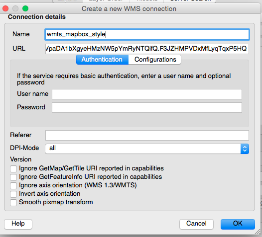


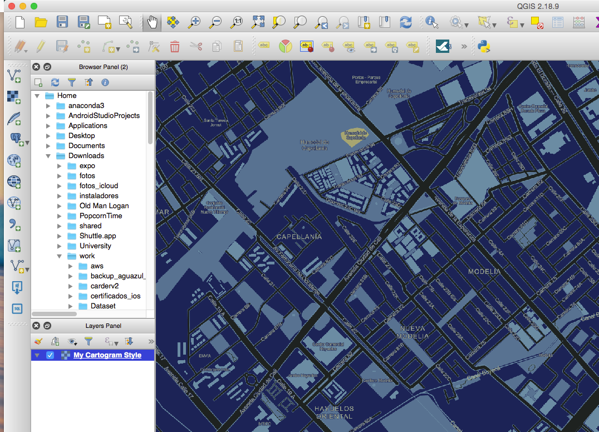


Personalizar estilos con Mapbox studio: 

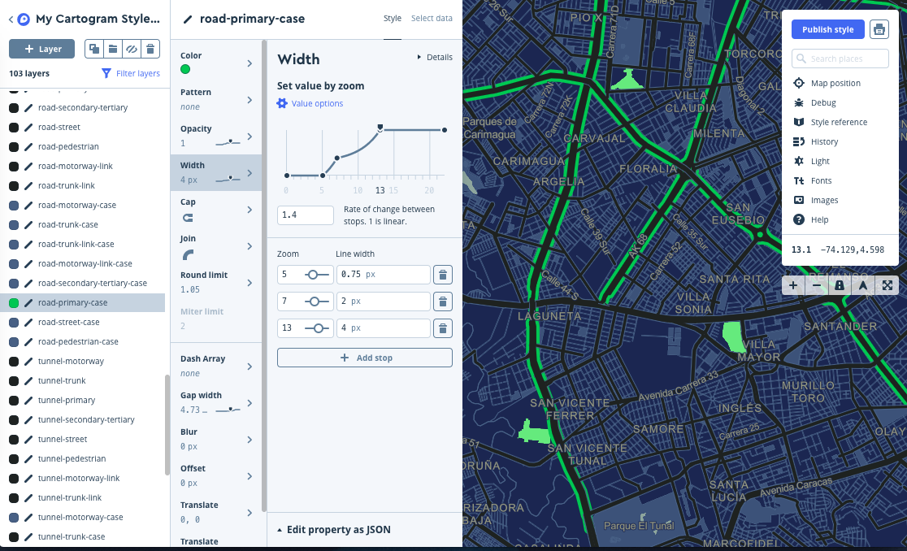

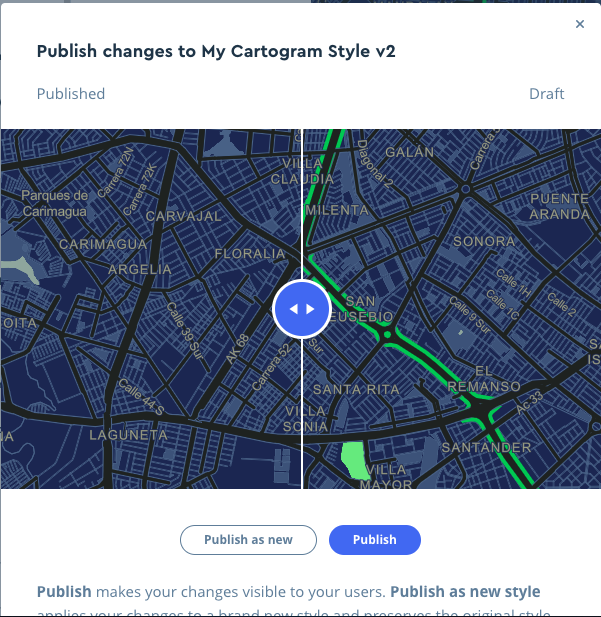


## Ejercicio 2: Mapa de coropletas (choropleth)  con Mapbox studio

* Datos: datos/stateData.geojson 
  * (Population density across US state (GeoJSON file is borrowed from the Leaflet choropleth tutorial https://leafletjs.com/examples/choropleth/ ) 
* Tutorial : "Make a choropleth map, Part 1: create a style" https://www.mapbox.com/help/choropleth-studio-gl-pt-1/

Resultado

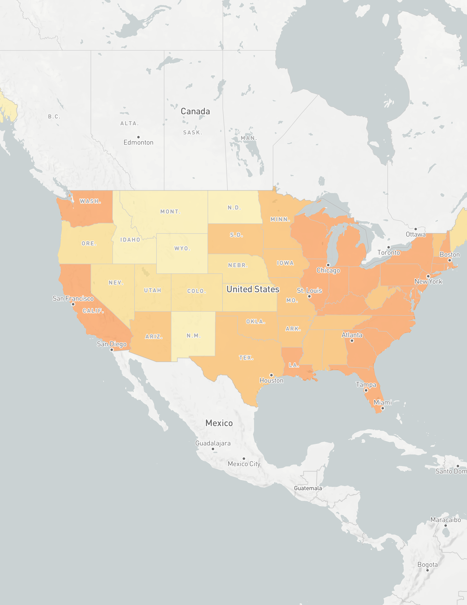


## Ejercicio 3: Introducción a Carto 

* Datos: Tweets Georreferenciados en Colombia recopilados del  19 al 28 de febrero de 2018 :   
  * tweets_2018.zip

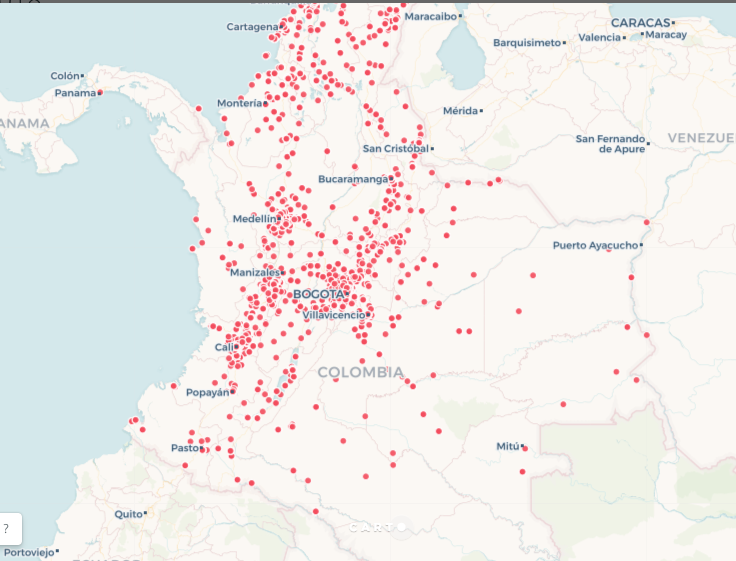


Ejemplo de la información contenida en el tweet:	_datos/tweet.geojson_

```json
 {
    "type": "Feature",
    "geometry": {
    "type": "Point",
    "coordinates": [
        -74.0833,
        4.6
    ]
    },
    "properties": {
    "cartodb_id": 14999,
    "id": 967763184885973000,
    "created": "2018-02-25T09:08:18Z",
    "place_name": "Bogotá, D.C.",
    "place_country": "Colombia",
    "source": "instagram",
    "screen_name": "Reggaetonerawy",
    "lang": "es",
    "tweet_text": "Regrann from @yandeloficial  -  Sin trabajo duro y disciplina es difícil ser un buen… https://t.co/ddQtxoiAxo"
    }
}
```

* Departamentos : MGN_ADM_MPIO_POLITICO.zip

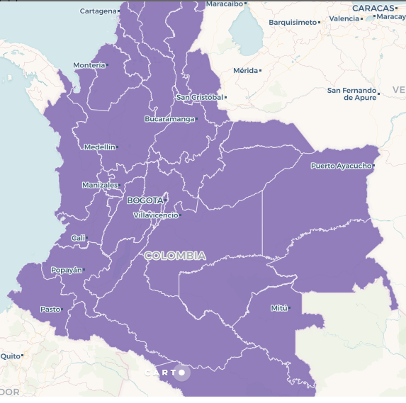

* Municipios: mgn_adm_mpio_politico_simplified.geojson.zip

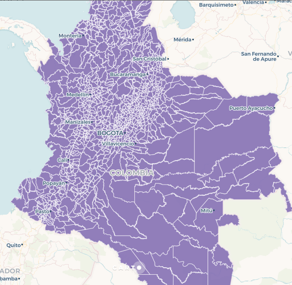


Revisar: 

* How CARTO works  https://carto.com/help/getting-started/
* Carto builder https://carto.com/help/tutorials/getting-started-with-carto-builder/
* Understanding Map Layers in Builder https://carto.com/help/tutorials/understanding-map-layers-in-builder/

Realizar lo siguiente: 

* Cargar datos en Carto

* Visualizar estructura de dataset

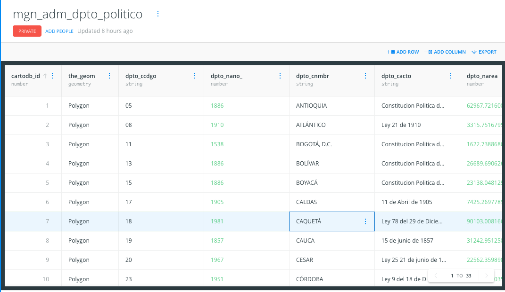


**Tip: Arquitectura de Carto**

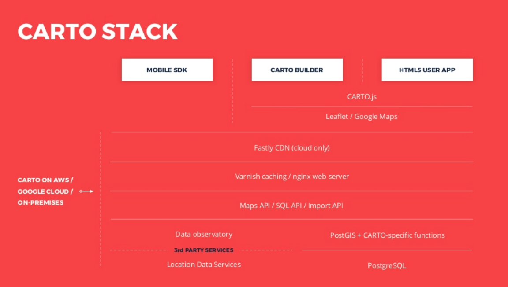

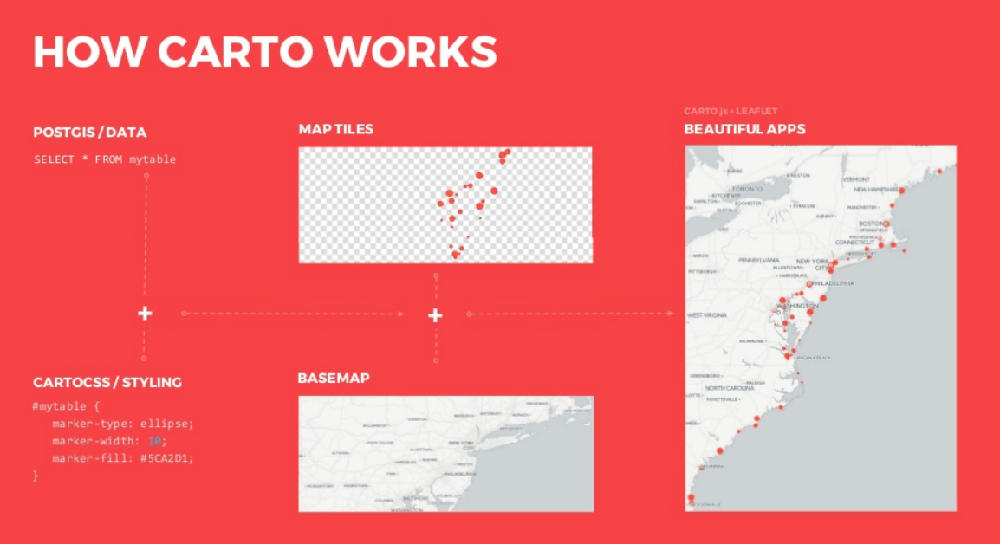


* Crear un mapa con los datos de los tweets

* Cambiar el mapa base: Comparar las siguientes opciones
	* Voyager
	* Positron
	* Dark Matter
	* Stamen Toner
	* Here Day
	* Nasa

* Adicionar el estilo que creó en mapbox como mapa base de carto

* cambiar el color, transparencia , tamaño y borde de los puntos de los tweets

* personalice el "pop-up" y la leyenda

* habilite el selector de Capa

* cambie la privacidad del mapa a "only accesible with link"

* publique el mapa

* Resultado

https://gkudos.carto.com/u/kudosg/builder/f7f21768-c27a-40ad-88d8-38ab19c6af12/embed

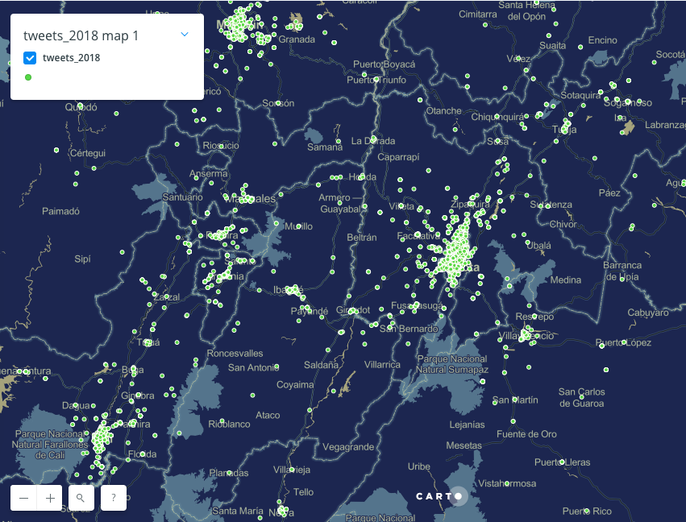


## Ejercicio 4:  Crear dashboard interactivo para el análisis de  tweets

* Cree un nuevo mapa en carto a partir de los datos de los tweets

* Adicione widget de línea de tiempo utilizando el atributo created  
	* Cambie la agregación de datos (buckets) a horas
	* Explore la línea de tiempo seleccionando un rango específico de tiempo (Ejm: 10 horas)
	* cambie el color
* Adicione widget de formula de tipo  _"feature count"_ para contar los datos que salen en pantalla
	* personalice el nombre, prefijo, sufijo y descripción según como considere necesario
* Adicione widget de categoría con e atributo "source" (aplicación desde la cual se creó el tweet )
* Repita el proceso de la categoría para los atributos lang, screen_name y place name
* cambie los colores del los puntos del tweet según como considere necesario
* personalice el pop-up de la capa de tweets    
		* click: todos los atributos
		* hover: nombre del usuario  y el texto  del tweet
* adicione la capa de departamentos, ubíquela por debajo de los tweets y cambie la simbología
* cambie la privacidad del mapa a "only accesible with link"
* publique el mapa
* explore los datos en el dashboard publicado haciendo diferentes combinaciones
* cree una nueva entrada en su blog de wordpress incluyendo el dashboard creado e incluya sus opiniones sobre el proceso.
	* Le pareciò fácil? difícil?
	* que particulares percibió de los datos luego del análisis interactivo?  
	* este tipo de dashboards serían útiles en su trabajo o profesión? ejemplos

Resultado:
https://gkudos.carto.com/u/kudosg/builder/b4fd7e58-379a-4101-9cd9-bad1111c6fc4/embed

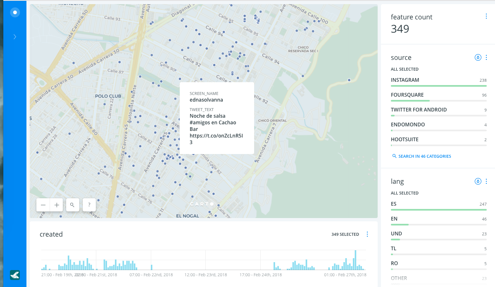


## Ejercicio 5:   Agregaciones / Densidad  con Carto

* Cree un nuevo mapa en carto a partir de los datos de los tweets y cambie la simbología agregando por cuadros o hexbins
* cambie la simbología según como considere necesario
* publique el mapa
* resultado : https://gkudos.carto.com/u/kudosg/builder/63e02f53-fd37-43cd-a35a-74bcd00047d9/embed

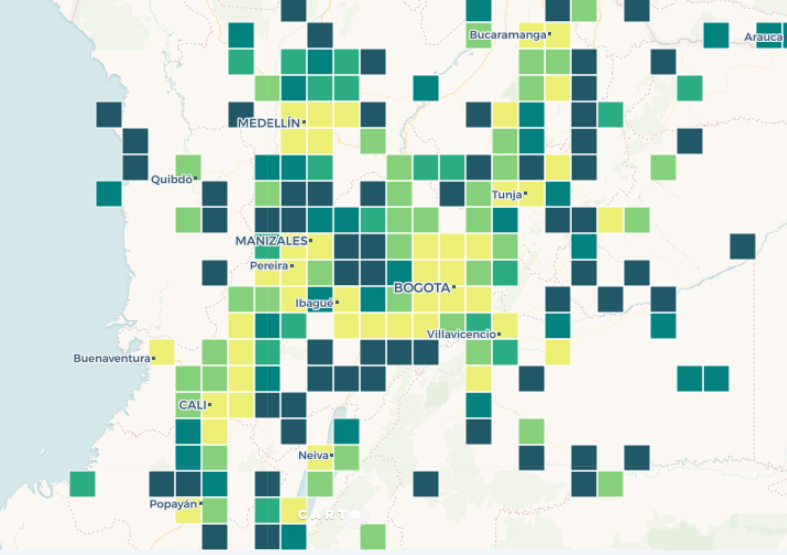

## Ejercicio 6:   Mapa de coropletas (choropleth) con Carto

* Cargue en carto el conjunto de datos stateData.geojson
* cree un mapa a partir de esos datos
* Simbolícelo por densidad y compare diferentes formas de clasificaciòn y rampas de color
* Adicione las etiquetas utilizando el atributo name
* explore la opción "cartocss" y revise el código generado por la herramienta
* publique el mapa
* resultado: https://gkudos.carto.com/u/kudosg/builder/ae9352da-4ad4-4941-9273-d04bf52ddda5/embed

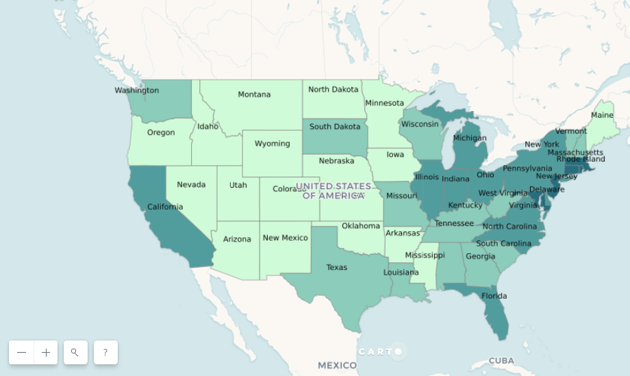


## Ejercicio 7:  Análisis espacial básico con Carto

Objetivo: Crear un mapa de municipios clasificado por la cantidad de tweets

* Cree  un nuevo mapa y adicione las capas de tweets y municipio
* seleccione la capa de municipios.
* Seleccione la opción de análisis :  "Intersect and Aggregate" 
  * https://carto.com/help/tutorials/intersect-and-aggregate/
  * capa de intersección :  tweets
  * medida: conteo
* Simbolice los municipios como coropletas  a partir del conteo de tweets
* adicione los widgets que considere necesarios para enriquecer la visualización
* resultado https://gkudos.carto.com/u/kudosg/builder/ecdf1d43-7d19-4c60-9b61-c20683818a00/embed

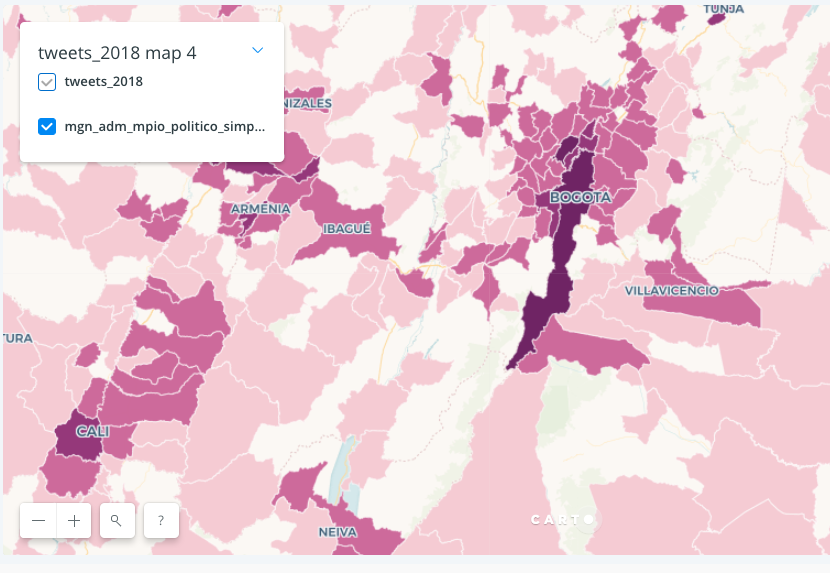

* Ejercicio para el estudiante:  Normalizar los datos!!!

## Ejercicio 8:  Enriquecer los datos con Análisis espacial utilizando Carto

**Objetivo:** 
Adicionar atributos a los datos a partir de procesos de análisis espacial.

En nuestro caso, adicionar al tweet un atributo que contenga el departamento en el que fue generado.

* Cree  un nuevo mapa y adicione la capas de departamentos y tweets_2018
* Adicione el análisis de tipo "Select Points in Polygons" (https://carto.com/help/tutorials/point-in-polygon/ utilizando como filtering layer los tweets
* Adicione widget de categoría por el atributo _source_first_depa_
* Adicine widget para conteo de datos a través del atributo source_cartodb_id
* publique el mapa
* Pregunta: cuantos tweets hay en total entre antioquia y cundinarca
* Resultado https://gkudos.carto.com/u/kudosg/builder/94b3c2bd-2856-4864-9fdb-8bd38f2869de/embed

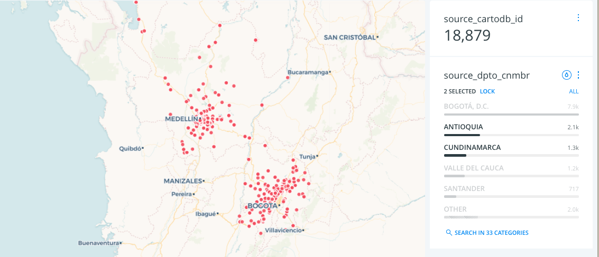


## Ejercicio 9:  Carto y Spatial SQL

Postgis

    PostGIS is an extension to the PostgreSQL object-relational database system which allows
    GIS (Geographic Information Systems) objects to be stored in the database. PostGIS
    includes support for GiST-based R-Tree spatial indexes, and functions for analysis
    and processing of GIS objects.

**Referencia de operaciones en postgis:**

http://www.postgis.org/docs/reference.html

Consultas utilizando SQL

*  Cuantos municipios tiene antioquia?

```sql
SELECT count(*) FROM mgn_adm_mpio_politico
where dpto_ccdgo = '05'
```

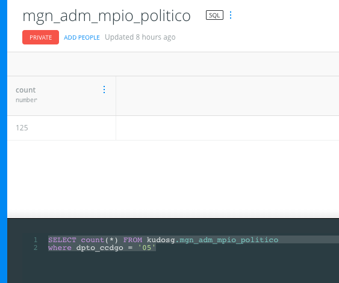

* Cuantos tweets se fueron creados con foursquare  en un radio de 2 km alrededor del centro comercial andino ?

```sql
with b as (
		select st_buffer( cdb_latlng(4.666742040, -74.05286452)::geography, 2000) as the_geom
)
select count(t.*)
from tweets_2018 as t , b
where st_intersects(t.the_geom, b.the_geom)
and t.source = 'foursquare'
```

Respuesta: 115

Ejemplo mapa:
https://gkudos.carto.com/u/kudosg/builder/2597eae1-1029-462d-80bd-ce3d3fba2538/embed

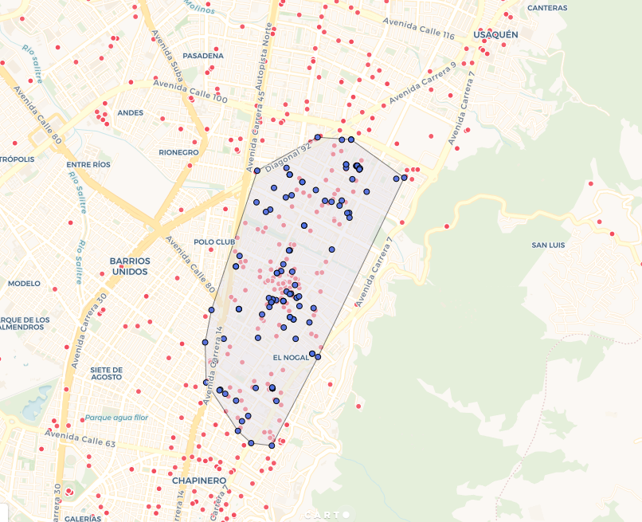


## Ejercicio 10:  Carto y Spatial SQL - Simplificación de Geometrías

ST_Simplify:  http://www.postgis.org/docs/ST_Simplify.html  

Datos sin Simplificar:

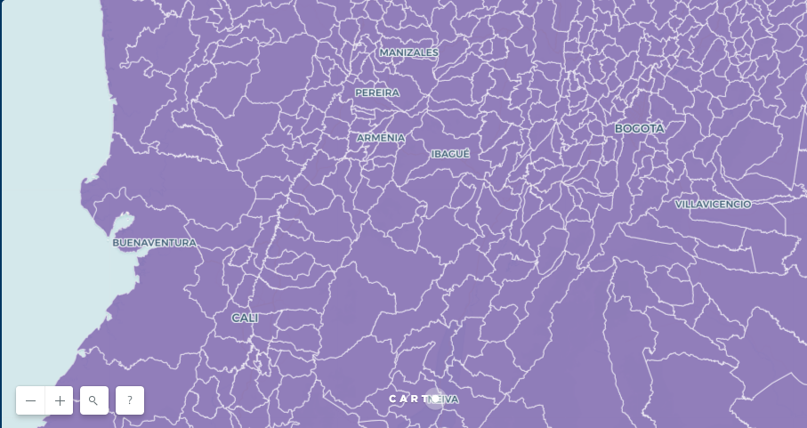


Consulta para simplificar:

```sql
SELECT st_simplify(the_geom, 0.001), mpio_cnmbr, mpio_ccnct
FROM mgn_adm_mpio_politico
```


Datos Simplificados:

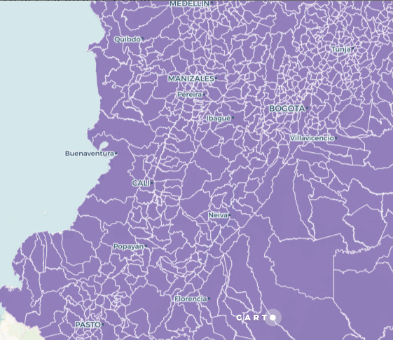

Datos Simplificados (Detalle):

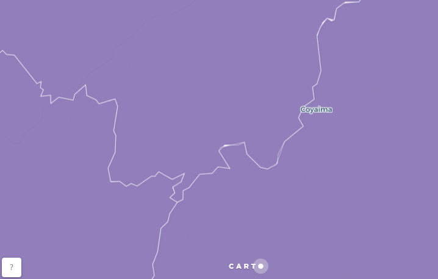

Comparación de Tamaños:

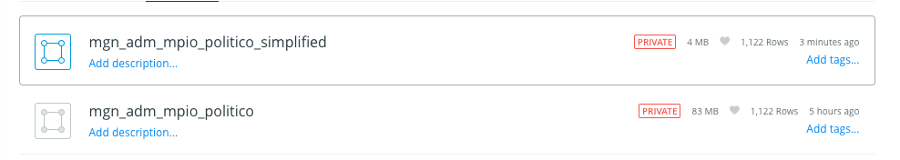


Consulta para actualizar la geometría de la tabla:

```sql
UPDATE mgn_adm_mpio_politico SET geom =  st_simplify(the_geom, 0.001)
```


Simplificar preservando la topología:

```sql
SELECT ST_SimplifyPreserveTopology(the_geom, 0.001), mpio_cnmbr, mpio_ccnct
FROM mgn_adm_mpio_politico
```


## Ejercicio 11:  Carto y Spatial SQL - Generación de geometrías

* Agrupar puntos en polígonos (convex hull) https://carto.com/help/tutorials/create-polygons-from-points/


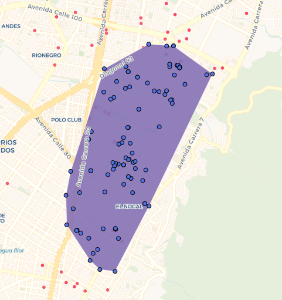

SQL Generado: 

```sql
SELECT
  row_number() over() as cartodb_id,
  ST_ConvexHull(ST_Collect(the_geom)) AS the_geom,
  count(1) as count_vals
FROM (with b as (
select st_buffer( cdb_latlng(4.666742040, -74.05286452)::geography, 2000) as the_geom 
)
select t.*
from tweets_2018 as t , b
where st_intersects(t.the_geom, b.the_geom)
and t.source = 'foursquare') _analysis_source
```

## Ejercicio 12:  Arcgis Online (Introducción)

* ArcGIS Online, Cloud-based GIS Mapping software https://www.esri.com/en-us/arcgis/products/arcgis-online/overview


Flujo de trabajo típico:

* Cargar (publicar) datos en la nube
* A partir de los datos publicados crear mapas web con la simbología.
* A partir de los mapas web generar aplicaciones. Ejm.
  * Story maps
  * Web Appbuilder
  * (Operations) Dashboard
  * etc..

* Video: Uso básico de arcgis online para publicar mapas y aplicaciones https://www.loom.com/share/f05d8f6b5ecd46e4b4e3bb4f48df9b18

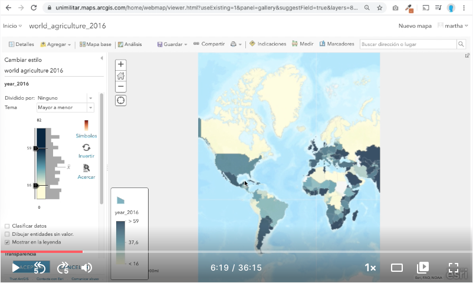

Más información:

* Documentación sobre Arcgis Online https://www.esri.com/en-us/arcgis/products/arcgis-online/resources
* Learning Plan - ArcGIS Online Fundamentals  (ESRI Training) https://www.esri.com/training/catalog/5b733e9d2fad23092c930883/arcgis-online-fundamentals/
* Introducción a ArcGIS Online  https://learn.arcgis.com/es/projects/get-started-with-arcgis-online/
* Esri's MOOC Program - Online courses on how to apply geography for a better world. https://www.esri.com/training/mooc/


## Ejercicio 13:  Geonode (Introducción)

Geonode http://geonode.org/

    Open Source Geospatial Content Management System
    GeoNode is a web-based application and platform for developing geospatial information systems (GIS) and for deploying spatial data infrastructures (SDI).

    It is designed to be extended and modified, and can be integrated into existing platforms.

Favor leer:

+ Introducción a Geonode https://es.slideshare.net/geosolutions/introduction-to-geonode-89583201
+ Geonode User Features http://geonode.org/user_features/
+ Spatial Data Infrastructure Best Practices with GeoNode https://es.slideshare.net/SebastianBenthall/spatial-data-infrastructure-best-practices-with-geonode?

*Arquitectura de Geonode*

  Imagen tomada de "GeoNode Integration with GIS
  and Data Processing workflows" http://siteresources.worldbank.org/INTLACREGTOPURBDEV/Images/840342-1264721236030/GeoNodeDM_2_IntegrationWithGISandDataProcessing.pdf  


## Documentación adicional 

El presente taller utiliza contenidos basados en recursos como los siguientes:

* Mapbox
	* Mapbox Studio Manual https://www.mapbox.com/help/studio-manual/
	* Make a choropleth map, Part 1: create a style  https://www.mapbox.com/help/choropleth-studio-gl-pt-1/
	* https://www.mapbox.com/help/tutorials/
* Carto
	* Carto documentation https://carto.com/docs/
	* Carto Guides https://carto.com/learn/guides/
	* Carto Tips https://carto.com/docs/tips-and-tricks/