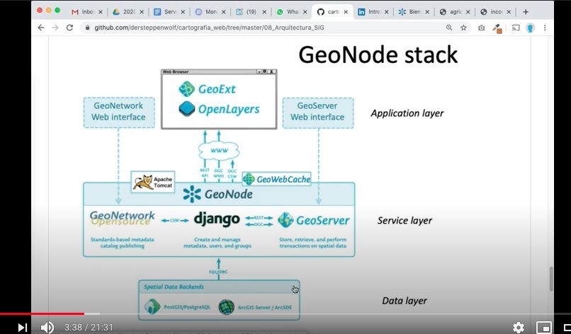
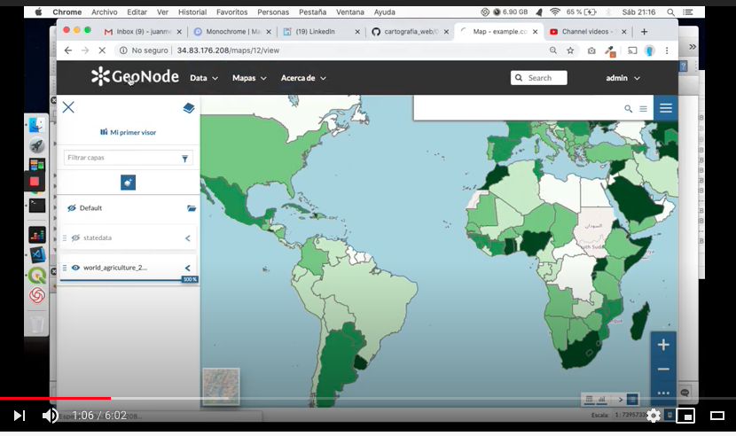
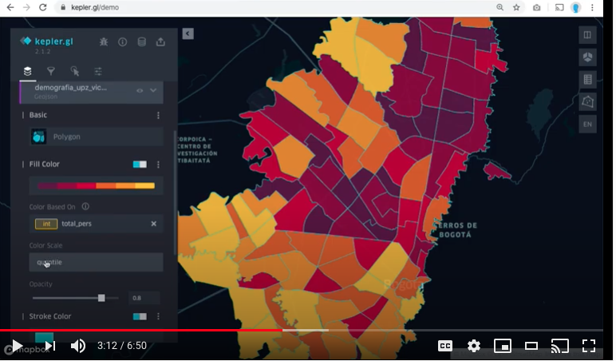
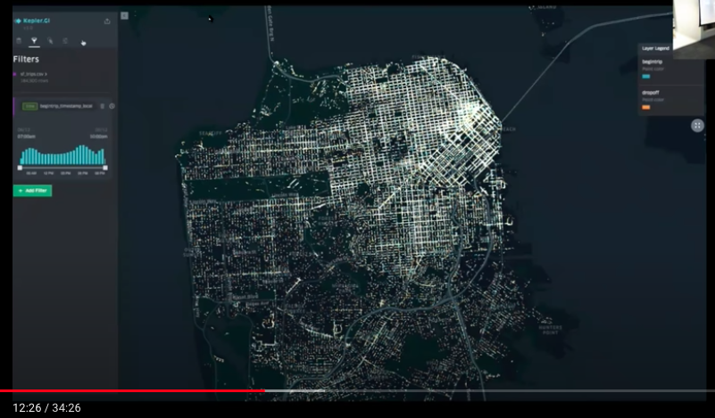
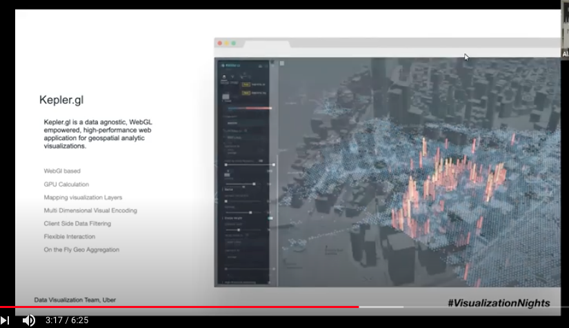
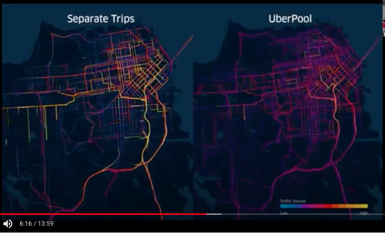

# Arquitectura de aplicaciones Web para SIG

- [Arquitectura de aplicaciones Web para SIG](#arquitectura-de-aplicaciones-web-para-sig)
  - [Presentación](#presentaci%C3%B3n)
  - [Bases de datos](#bases-de-datos)
  - [Arquitectura de aplicaciones SIG : Lecturas](#arquitectura-de-aplicaciones-sig--lecturas)
  - [Artículos de interés](#art%C3%ADculos-de-inter%C3%A9s)
  - [Taller](#taller)
    - [Creando un tablero de control con Carto](#creando-un-tablero-de-control-con-carto)
    - [Geonode](#geonode)
      - [Servidor Geonode para pruebas en clase](#servidor-geonode-para-pruebas-en-clase)
      - [Introducción](#introducci%C3%B3n)
      - [Arquitectura](#arquitectura)
      - [Tutoriales](#tutoriales)
      - [Documentación adicional](#documentaci%C3%B3n-adicional)
    - [Kepler.gl](#keplergl)
      - [Documentación](#documentaci%C3%B3n)
      - [Ejemplo](#ejemplo)
      - [Información adicional](#informaci%C3%B3n-adicional)

## Presentación

Enlace https://github.com/dersteppenwolf/cartografia_web/blob/master/08_Arquitectura_SIG/08_Arquitectura_aplicaciones_Web_SIG.pdf

## Bases de datos 

- AWS: Enter the purpose-built database era: Finding the right database for the right job https://pages.awscloud.com/rs/112-TZM-766/images/Enter_the_Purpose-Built-Database-Era.pdf
- AWS - Ingrese a la era de las bases de datos personalizadas: Encuentre la base de datos adecuada para el trabajo adecuado https://es.slideshare.net/dersteppenwolf/aws-ngrese-a-la-era-de-las-bases-de-datos-personalizadas-encuentre-la-base-de-datos-adecuada-para-el-trabajo-adecuado


## Arquitectura de aplicaciones SIG : Lecturas

- Architecting the ArcGIS Platform: Best Practices https://assets.esri.com/content/dam/esrisites/en-us/media/pdf/architecting-the-arcgis-platform.pdf

## Artículos de interés

- Design and implementation of spatial database and geo-processing models for a road geo-hazard information management and risk assessment system WeiDong Wang, Jie Wu, LiGang Fang, Ke Zeng, XinSheng Chang

- Creating a Data Portal for Small Rivers in Rostock
  Sebastian Hübner, Ferdinand Vettermann, Christian Seip and Ralf Bill
  https://link.springer.com/chapter/10.1007/978-3-319-44711-7_24

- Service Oriented Architecture Based SDI Model for Education Sector in India
  Rabindra K. Barik1 and Arun B. Samaddar2
  https://link.springer.com/chapter/10.1007/978-3-319-02931-3_63

- Automated Web-Based Geoprocessing of Rental Prices
  Harald Schernthanner1, Sebastian Steppan, Christian Kuntzsch, Erik Borg and Hartmut Asche
  https://link.springer.com/chapter/10.1007/978-3-319-62401-3_37

- Geospatial Big Data: Challenges and Opportunities. Jae-Gil Lee, Minseo Kang

## Taller 

### Creando un tablero de control con Carto

**Videotutorial**

<a href="https://www.youtube.com/watch?v=9UaAdF2ZkOM&feature=youtu.be" target="_blank" >

</a>

**Datos:**

data/world_agriculture_2016.zip

**Modelo de datos:**


**Atributos principales:**

* geom: Geometría tipo polígono
* incomegroup: Categórica.  Nivel de ingreso.
* world_region: Categórica. Región del mundo
* year_2016: Secuencial.  % de área cultivable


**Mockup:** 


**Dashboard Resultado**

<a href="https://gkudos.carto.com/u/kudosg/builder/501b7abf-3809-41e7-a71b-39223fb3dbbf/embed" target="_blank" >

</a>


### Geonode

Geonode http://geonode.org/

    Open Source Geospatial Content Management System
    GeoNode is a web-based application and platform for developing 
    geospatial information systems (GIS) and for 
    deploying spatial data infrastructures (SDI).

    It is designed to be extended and modified, 
    and can be integrated into existing platforms.

SDI

    A spatial data infrastructure (SDI) is a data 
    infrastructure implementing a framework of geographic 
    data, metadata, users and tools that are interactively 
    connected in order to use spatial data in an 
    efficient and flexible way. 

#### Servidor Geonode para pruebas en clase


* Url Geonode http://34.83.176.208
* Url WMS Geonode http://34.83.176.208/geoserver/wms?version=1.3.0&request=GetCapabilities 
* Url WFS Geonode http://34.83.176.208/geoserver/wfs?version=2.0.0&request=GetCapabilities 
* Url CSW Geonode http://34.83.176.208/catalogue/csw
  * Consultando el catálogo de geonode con QGIS https://docs.qgis.org/3.10/en/docs/user_manual/plugins/core_plugins/plugins_metasearch.html?highlight=csw

#### Introducción 

+ Introducción a Geonode https://es.slideshare.net/geosolutions/introduction-to-geonode-89583201

#### Arquitectura 

  Imagen tomada de "GeoNode Integration with GIS
  and Data Processing workflows" http://siteresources.worldbank.org/INTLACREGTOPURBDEV/Images/840342-1264721236030/GeoNodeDM_2_IntegrationWithGISandDataProcessing.pdf  


#### Tutoriales

+ Videotutorial: Introducción a Geonode

<a href="https://youtu.be/NDsHEOe3luw" target="_blank" >

</a>


+ Videotutorial: Utilizando servicios de Geonode

<a href="https://youtu.be/6hK5x62K_14" target="_blank" >

</a>


+ Video - Seminario Taller web: Manejo básico de GeoNode   https://www.youtube.com/watch?v=N1OqQb8b3pI&feature=youtu.be
  + Nota: El tutorial para la carga de datos empieza en el minuto 9:44 https://youtu.be/N1OqQb8b3pI?t=584

<a href="https://youtu.be/N1OqQb8b3pI?t=584" target="_blank" >

</a>


#### Documentación adicional

+ Geonode User Features http://geonode.org/user_features/
+ Publicando datos y mapas: GeoNode Quickstart  https://live.osgeo.org/es/quickstart/geonode_quickstart.html
+ Bringing GEOSS services into Practice for Beginners: GeoNode Tutorial https://es.slideshare.net/dersteppenwolf/bringing-geoss-services-into-practice-for-beginners-geonode-tutorial
+ Spatial Data Infrastructure Best Practices with GeoNode https://es.slideshare.net/SebastianBenthall/spatial-data-infrastructure-best-practices-with-geonode?


### Kepler.gl

**Kepler.gl**  https://kepler.gl/ __Kepler.gl is a powerful open source geospatial analysis tool for large-scale data sets.__

Kepler.gl is a data-agnostic, high-performance web-based application for visual exploration of large-scale geolocation data sets. Built on top of **Mapbox GL** and **deck.gl**, kepler.gl can render millions of points representing thousands of trips and perform spatial aggregations on the fly.

+ Videotutorial: Introducción a Kepler.gl

<a href="https://youtu.be/lBDApe6UKY8" target="_blank" >

</a>

* Exploring large-scale geospatial data on the web with Kepler.gl

<a href="https://www.youtube.com/watch?v=i2fRN4e2s0A" target="_blank" >

</a>

*  Uber,   Introduction to Kepler.gl  

<a href="https://www.youtube.com/watch?v=b8wKEY4dlvg" target="_blank" >

</a>

* Introduction: Kepler.gl & Movement Speeds

<a href="https://www.youtube.com/watch?v=0G8tiGd7RBQ" target="_blank" >

</a>


#### Documentación 

- From Beautiful Maps to Actionable Insights: **Introducing kepler.gl**, Uber’s Open Source Geospatial Toolbox https://eng.uber.com/keplergl/
- User guide: https://github.com/keplergl/kepler.gl/blob/master/docs/user-guides/j-get-started.md
- Código en Github https://github.com/keplergl/kepler.gl
- **How to create a map in 3 minutes:** Animating 40 years of California Earthquakes https://medium.com/vis-gl/animating-40-years-of-california-earthquakes-e4ffcdd4a289
- **Making a choropleth map:** Visualizing Unemployment for U.S. Counties with kepler.gl https://medium.com/vis-gl/visualizing-u-s-county-unemployment-with-kepler-gl-c5f2ed31c71
-  Uber Movement and kepler.gl : Using kepler.gl and Movement data to Visualize Traffic Effects of a Rainstorm https://medium.com/vis-gl/movement-in-kepler-d00e843f464d


#### Ejemplo

**Datos Tweets Georreferenciados:**

 - Formato Csv https://github.com/dersteppenwolf/cartografia_web/blob/master/03_Cartografia/example/geotweets.csv

|id                 |source      |user.screen_name|pin.location.lat|pin.location.lon|lang|creation_date      |user.followers_count|entities.hashtags.text                   |
|-------------------|------------|----------------|----------------|----------------|----|-------------------|--------------------|-----------------------------------------|
|1201026267883065344|instagram   |alitos25        |3.47645398      |-76.52784348    |es  |2019-12-01T01:32:30|696                 |Chipichape,Mom,Diciembre,ILoveYou        |
|1201026433306357767|instagram   |GuillermoLVP80  |3.89502747      |-76.29474677    |es  |2019-12-01T01:33:10|15                  |nuevostalentos,guadalajaradebuga         |
|1201026492236533760|instagram   |COMBOESTRELLAS  |4.83553936      |-75.66899716    |es  |2019-12-01T01:33:24|727                 |elcombodelasestrellas,marlonmuriel,envivo|
|1201027339578007552|world cities|MedellinCO      |6.24            |-75.59          |en  |2019-12-01T01:36:46|133                 |                                         |


 - Formato geojson https://github.com/dersteppenwolf/cartografia_web/blob/master/03_Cartografia/example/geotweets.geojson

```json
{
"type": "FeatureCollection",
"name": "geotweets",
"crs": { "type": "name", "properties": { "name": "urn:ogc:def:crs:OGC:1.3:CRS84" } },
"features": [
{ "type": "Feature", "properties": { "id": "1201026267883065344", "source": "instagram", "user.screen_name": "alitos25", "pin.location.lat": "3.47645398", "pin.location.lon": "-76.52784348", "lang": "es", "creation_date": "2019-12-01T01:32:30", "user.followers_count": "696", "entities.hashtags.text": "Chipichape,Mom,Diciembre,ILoveYou" }, "geometry": { "type": "Point", "coordinates": [ -76.52784348, 3.47645398 ] } },
{ "type": "Feature", "properties": { "id": "1201026433306357767", "source": "instagram", "user.screen_name": "GuillermoLVP80", "pin.location.lat": "3.89502747", "pin.location.lon": "-76.29474677", "lang": "es", "creation_date": "2019-12-01T01:33:10", "user.followers_count": "15", "entities.hashtags.text": "nuevostalentos,guadalajaradebuga" }, "geometry": { "type": "Point", "coordinates": [ -76.29474677, 3.89502747 ] } },
{ "type": "Feature", "properties": { "id": "1201026492236533760", "source": "instagram", "user.screen_name": "COMBOESTRELLAS", "pin.location.lat": "4.83553936", "pin.location.lon": "-75.66899716", "lang": "es", "creation_date": "2019-12-01T01:33:24", "user.followers_count": "727", "entities.hashtags.text": "elcombodelasestrellas,marlonmuriel,envivo" }, "geometry": { "type": "Point", "coordinates": [ -75.66899716, 4.83553936 ] } },

```

Archivo Html Generado por kepler.gl 
- vista web https://dersteppenwolf.github.io/cartografia_web/03_Cartografia/example/kepler.gl.html
- código https://github.com/dersteppenwolf/cartografia_web/blob/master/03_Cartografia/example/kepler.gl.html


#### Información adicional  

- **Mapbox GL JS** is a JavaScript library that uses WebGL to render interactive maps from vector tiles and Mapbox styles.  https://docs.mapbox.com/mapbox-gl-js/api/
- **WebGL**	It is the JavaScript binding for OpenGL. OpenGL (Open Graphics Library) is a cross-language, cross-platform API for 2D and 3D graphics. https://www.tutorialspoint.com/webgl/webgl_introduction.htm
  - It is a JavaScript API that can be used with HTML5. WebGL code is written within the <canvas> tag of HTML5. It is a specification that allows Internet browsers access to Graphic Processing Units (GPUs) on those computers where they were used.
- **deck.gl** is a WebGL-powered framework for visual exploratory data analysis of large datasets. https://deck.gl/#/
