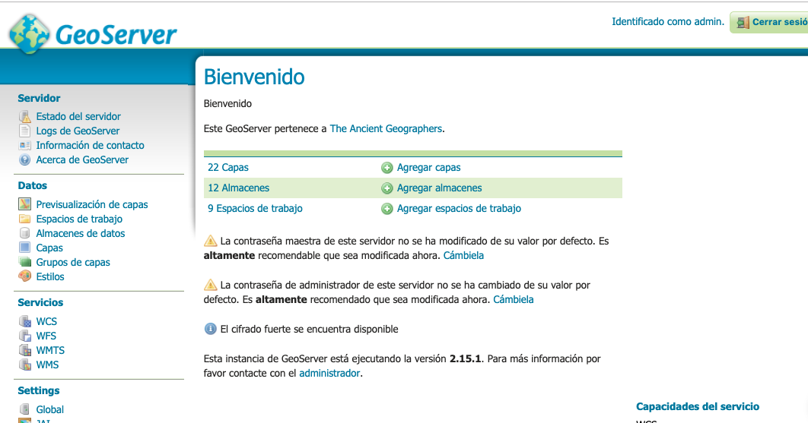

# Geoserver   

Descripción de la configuración de geoserver generada para la clase

- [Geoserver](#geoserver)
  - [Requerimientos](#requerimientos)
  - [Procedimiento utilizado para configurar la versión](#procedimiento-utilizado-para-configurar-la-versi%C3%B3n)
  - [Ejecutar Tomcat](#ejecutar-tomcat)
  - [Presentaciones](#presentaciones)

## Requerimientos

* Java 8 https://www.oracle.com/technetwork/java/javase/downloads/jdk8-downloads-2133151.html
  * Tutorial : ¿Cómo puedo descargar e instalar Java en un equipo con Windows de forma manual? https://www.java.com/es/download/help/windows_manual_download.xml

## Procedimiento utilizado para configurar la versión

Se utilizaron las instrucciones publicadas en https://docs.geoserver.org/latest/en/user/installation/war.html

* Se descargó la versión __Web Archive__ de GeoServer 2.15.1 desde la página oficial http://geoserver.org/release/stable/
* Se descargó la versión __zip_ de   de  apache tomcat 9.0.20  desde la página oficial  https://tomcat.apache.org/download-90.cgi
* Se descomprimió el archivo zip de apache tomcat (apache-tomcat-9.0.20.zip)
* Se descomprimió el archivo zip de geoserver (geoserver-2.15.1-war.zip)
* Se copió el archivo __geoserver.war__ dentro de la carpeta __apache-tomcat-9.0.20/webapps/__
* Se inició tomcat.  La aplicación descomprime el contenido del archivo __geoserver.war__ en la carpeta __apache-tomcat-9.0.20/webapps/geoserver__
* Detener geoserver
* Extensiones
  * Adicionar extensiones: Para instalar las extensiones debe descargar el archivo zip de la extensión en particular, descomprimirlo y compiar los archivos __.jar__ en la carpeta __apache-tomcat-9.0.20/webapps/geoserver/WEB-INF/lib__ 
  * Para la presente configuración se adicionaron las siguientes extensiones:
    * CSS Styling  https://docs.geoserver.org/latest/en/user/styling/css/index.html
    * YSLD Styling https://docs.geoserver.org/latest/en/user/styling/ysld/index.html 
    * MBStyle Styling https://docs.geoserver.org/latest/en/user/styling/mbstyle/index.html
    * Vector tiles https://docs.geoserver.org/latest/en/user/extensions/vectortiles/index.html
* Datos
  * Además de los datos que vienen de ejemplo por omisión se adicionaron los siguientes conjuntos de datos:
    * OpenStreetMap de Colombia descargado desde geofabrik (formato shp) 
      * Url descarga: https://www.geofabrik.de/data/download.html
      * Diccionario de datos: http://download.geofabrik.de/osm-data-in-gis-formats-free.pdf
      * Ruta de los datos __apache-tomcat-9.0.20/webapps/geoserver/data/data/openstreetmap_colombia.shp__
  * Natural Earth (países, centros poblados)
    * Url descarga: https://www.naturalearthdata.com/downloads/110m-cultural-vectors/
    * Ruta de los datos __apache-tomcat-9.0.20/webapps/geoserver/data/data/natural_earth__

## Ejecutar Tomcat

Para iniciar el servidor apache tomcat:
  * En Windows : Ejecutar el archivo __apache-tomcat-9.0.20/bin/startup.bat__
  * En Linux o Mac: Ejecutar el archivo __apache-tomcat-9.0.20/bin/startup.sh__

* Luego de iniciar la aplicación debe poder acceder a tomcat a través del siguiente enlace http://localhost:8080/geoserver/
* Deberá ver una pantalla similar a la siguiente:

* Contraseña de administrador default:
  * Usuario: admin
  * Clave: geoserver

Para detener tomcat:
  * En Windows : Ejecutar el archivo __apache-tomcat-9.0.20/bin/shutdown.bat__
  * En Linux o Mac: Ejecutar el archivo __apache-tomcat-9.0.20/bin/shutdown.sh__ 

## Presentaciones

* GeoServer, an introduction for beginners https://es.slideshare.net/geosolutions/geoserver-an-introduction-for-beginner
* State of GeoServer 2.14 https://es.slideshare.net/jgarnett/state-of-geoserver-214
* GeoServer in Production: we do it, here is how! https://www.slideshare.net/geosolutions/geoserver-in-production-we-do-it-here-is-how-foss4g-2016
* Advanced Security with GeoServer - FOSS4G 2015 https://www.slideshare.net/geosolutions/advanced-security-with-geoserver-foss4g-2015

