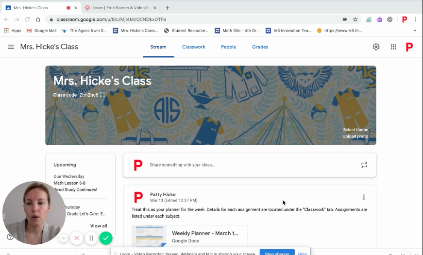

# Publicación de cartografía vía web

- [Publicación de cartografía vía web](#publicaci%C3%B3n-de-cartograf%C3%ADa-v%C3%ADa-web)
  - [Programa](#programa)
  - [Área de formación](#%C3%A1rea-de-formaci%C3%B3n)
  - [Docente](#docente)
  - [Programación](#programaci%C3%B3n)
  - [Enfoque](#enfoque)
  - [Justificación](#justificaci%C3%B3n)
  - [Objetivo general](#objetivo-general)
  - [Competencia global](#competencia-global)
  - [Competencias específicas](#competencias-espec%C3%ADficas)
  - [Esquema general de los contenidos](#esquema-general-de-los-contenidos)
    - [Unidad 1: Conceptos Generales sobre Tecnologías Web y SIG](#unidad-1-conceptos-generales-sobre-tecnolog%C3%ADas-web-y-sig)
    - [Unidad 2: Servicios web, geoservicios y OGC](#unidad-2-servicios-web-geoservicios-y-ogc)
    - [Unidad 3: Arquitectura de aplicaciones Web para SIG](#unidad-3-arquitectura-de-aplicaciones-web-para-sig)
    - [Unidad 4: Visualización de datos](#unidad-4-visualizaci%C3%B3n-de-datos)
  - [Sistema de evaluación](#sistema-de-evaluaci%C3%B3n)
  - [Notas](#notas)
  - [Bibliografía](#bibliograf%C3%ADa)
  - [Educación virtual](#educaci%C3%B3n-virtual)
    - [Herramientas](#herramientas)
    - [Enlaces de interés](#enlaces-de-inter%C3%A9s)
  - [Tareas](#tareas)
    - [Entrega de tareas](#entrega-de-tareas)
    - [Tarea 1 - Publicación de mapas web básicos](#tarea-1---publicaci%C3%B3n-de-mapas-web-b%C3%A1sicos)
    - [Tarea 2 - Publicación de mapas bajo estándares OGC utilizando base de datos espacial y servidor de mapas](#tarea-2---publicaci%C3%B3n-de-mapas-bajo-est%C3%A1ndares-ogc-utilizando-base-de-datos-espacial-y-servidor-de-mapas)

## Programa

[Especialización de Geomática, Universidad Militar Nueva Granada](http://www.umng.edu.co/web/guest/programas-academicos/facultad-ingenieria/posgrados/especializaciones/especializacion-geomatica)

## Área de formación

Desarrollo de nuevas tecnologías

## Docente

Juan Carlos Méndez
juan[~at~]gkudos.com

## Programación

Total: 32 horas

Horario: 18:00 a 22:00

Días:

- Semana 1: 
  - Lunes 30 de Marzo : 0 - Introducción.  1 - Fundamentos de Internet.
  - Martes 31 de Marzo: 2  - Los SIG y la Web
  - Miércoles 1 de Abril: 3 - Cartografía  
- Semana 2: 
  - Martes 14 de Abril: 4 - Servicios web, geoservicios y OGC
  - Miércoles 15 de Abril: 5 - Servidores de mapas 
- Semana 3: 
  - Miércoles 22 de Abril: 6 - Simbología para Mapas Web
- Semana 4: 
  - Miércoles 29 de Abril: 7 -
- Semana 5: 
  - Lunes  11  de Mayo: 8 -  

## Enfoque

Entender los conceptos básicos sobre las tecnologías web aplicables a la cartografía y adquirir destrezas básicas en tecnologías para publicar datos georreferenciados y servicios web geográficos.

## Justificación

Los datos georreferenciados son cada es más utilizados en la industria como elemento de apoyo para la toma de decisiones.

Uno de las disciplinas en el campo de la geomática que más se ha beneficiado con el avance de las tecnologías para la web es el de la cartografía. En ese orden de ideas es conveniente que los profesionales en geomática conozcan los elementos principales y técnicas básicas que pueden utilizarse para la publicación de datos geográficos y mapas a través de la web.

## Objetivo general

Entender los conceptos, técnicas y tecnologías básicos para la publicación de cartografía a través de la web.

## Competencia global

Desarrollar destrezas para publicar y utilizar datos georreferenciados a través de la web.

## Competencias específicas

- Ocupacionales y profesionales

  - Adquirir destrezas para publicar información geográfica en la Web.

- Cognitivas

  - Entender qué son los servicios web geográficos (geoservicios)
  - Entender los conceptos de las tecnologías web aplicables a la publicación de servicios web geográficos.
  - Crear y publicar mapas para la web
  - Crear y publicar servicios geográficos según los estándares de la OGC
  - Entender que son los modelos SIG y como publicarlos en la web
  - Utilizar geoservicios

- Comunicativas

  - Desarrollar la habilidad de argumentar técnicamente las estrategias a utilizar para publicar y utilizar servicios web geográficos según las necesidades particulares del caso de negocio a resolver.
  - Desarrollar la habilidad de argumentar técnicamente la importancia de la interoperabilidad de la información georreferenciada a través de servicios web.

- Investigativas
  
  - Fortalecer su capacidad investigativa y analítica a través del desarrollo del curso.

## Esquema general de los contenidos

### Unidad 1: Conceptos Generales sobre Tecnologías Web y SIG

- Objetivo específico
  - Identificar los conceptos básicos de las tecnologías utilizas para la publicación de servicios web geográficos.
- Temas:
  - Introducción a las Tecnologías Web y SIG
  - Introducción a la cartografía
  - Introducción al geoprocesamiento

### Unidad 2: Servicios web, geoservicios y OGC

- Objetivo específico
  - Conocer las generalidades sobre geoservicios y estándares OGC
- Temas:
  - Introducción a servicios web
  - Fundamentos sobre aplicaciones web
  - Tecnologías para el desarrollo de aplicaciones web
  - Arquitecturas orientadas a servicios
  - OGC y estándares para servicios web geográficos (WMS, WMTS, WFS, WCS,CSW , WPS)
  - Retos de publicación y optimización

### Unidad 3: Arquitectura de aplicaciones Web para SIG

- Objetivo específico
  - Conocer las generalidades sobre arquitecturas de software para la publicación de geoservicios y aplicaciones web para SIG
- Temas
  - Introducción arquitectura de aplicaciones web
  - Servidores de mapas
  - Simbología para mapas en la web
  - Servicios en la nube
  - Apis, servicios web.
  - Ejemplos de aplicaciones

### Unidad 4: Visualización de datos

- Objetivo específico
  - Conocer tecnologías y servicios aplicables para la visualización y uso datos georreferenciados en la web.
- Temas
  - Clientes ligeros
  - Servicios en la nube
  - Notebooks
  - Ejemplos de implementación

## Sistema de evaluación

- Se propondrán temáticas, en las cuales los participantes deberán demostrar la aplicación de los conceptos y conocimientos, así como las destrezas y capacidades obtenidas en desarrollo de los mismos.
- Con tres (3) fallas injustificadas se pierde la asignatura. La justificación de las fallas será evaluada por la Facultad, de conformidad con la validación de las razones y documentos que se adjunten.
- Exámenes cortos sobre teoría (quiz) y trabajos prácticos.
- Las tareas deben ser entregadas antes de la fecha máxima indicada.
- Las entrega tardía de tareas genera penalización en las notas
- Las tareas se publican a través de un respositorio personal creado en github https://github.com/

## Notas

  - Exámenes cortos (Quiz) - Individual: 30%  
    - Instalar kahoot en sus dispositivos móviles https://kahoot.com/
  - Tarea 1 - Publicación de mapas web básicos  - 20%
  - Tarea 2 - Servicios Web Geográficos -  20%
  - Tarea 3 - Aplicación Web -  30%

## Bibliografía

- Sistemas de Información Geográfica: Un libro libre de Víctor Olaya http://volaya.github.io/libro-sig/
- Abdalla, R. (2016). Introduction to geospatial information and communication technology (GeoICT). Switzerland: Springer.
- Harmon, J. E., & Anderson, S. J. (2003). The design and implementation of geographic information systems. Hoboken, NJ: J. Wiley.
- A., B. P., M., L. V., & Abarca, O. (2012). Fundamentos de las infraestructuras de datos espaciales. Madrid: UPM Press.
- Abdalla, R. (2016). Distributed GIS Technology. In Introduction to Geospatial Information and Communication Technology (GeoICT) (pp. 63–81). Springer International Publishing. https://doi.org/10.1007/978-3-319-33603-9_4
- Architecting the ArcGIS Platform: Best Practices https://assets.esri.com/content/dam/esrisites/en-us/media/pdf/architecting-the-arcgis-platform.pdf
- Libros recomendados sobre SIG https://twitter.com/ramiroaznar/status/1210269334830026755
- Libros recomendados sobre cartografía https://twitter.com/ramiroaznar/status/1247439889794244609

## Educación virtual

En vista de los últimos acontecimientos para todos conocidos, el curso se llevará a cabo de forma virtual.
Dada la eventualidad y premura respecto a la preparación  y desarrollo de cursos virtuales,  se agradece su retroalimentación y comentarios constructivos con ánimo de mejorar. 

A continuación un listado de recursos y herramientas propuestas para el desarrollo del presente curso.

### Herramientas

- Publicación de contenidos: **Github** https://github.com/
  - Ventajas: Publicación y versionamiento de archivos.  Publicación simple de páginas web con Markdwon
  - Sistema de "issues" para reporte de preguntas,   tareas y ejercicios.
- Publicación de sitios web:  **Github Pages** https://pages.github.com/
  - Publica automáticamente sitios web a partir de contenidos dispuestos en repositorios de github
- Videoconferencia: **Google Meet** https://gsuite.google.com/intl/es-419/products/meet/ 
  - Ventajas: Hasta 100 usuarios, Chat, Compartir pantalla
  - Más información: Comparación con hangouts  https://support.google.com/a/answer/7303775?hl=es
- Evaluación: **Kahoot** https://kahoot.com/
  - Ventajas: Evaluación a través de juegos
  - Aplicación móvil https://kahoot.com/mobile-app/
- Documentos Colaborativos: **Google Docs / Google sheets**    https://www.google.com/docs/about/
  - Ventajas: Compartir documentos en tiempo real. Edición colaborativa de documentos
- Comunicación: **Slack** https://slack.com/
  - Espacio de trabajo: https://cartografaweb.slack.com
  - Ventajas: Canales por tema. Notificaciones en tiempo real. Aplicación móvil, desktop. Integración con otras plataformas.
  -  Más información: How I Use Slack Inside of the Classroom: Adventures in the collaboration tool that has taken the world by storm. https://www.philsimon.com/blog/higher-education/use-slack-inside-classroom/
  -  Instaladores
     -  Para Android https://slack.com/intl/es-co/downloads/android
     -  Para windows https://slack.com/intl/es-co/downloads/windows
     -  Para Mac https://slack.com/intl/es-co/downloads/mac
- Tableros en línea: 
  - Web Whiteboard https://www.webwhiteboard.com/
    - Ventajas: Los tableros gratuitos están disponibles por 3 semanas.
    - Desventaja: A veces falla al exportar el tablero a png.
  - Ziteboard https://ziteboard.com/
    - Ventajas: La versión gratuita permite crear hasta 3 tableros por usuario. Exportación de tableros en png, pdf, jpg, svg.
    - Desventajas: La versión gratuita no tiene "Highlighter pens"
- Entorno interactivo para programación en python: **Google Colab**  https://colab.research.google.com/
  - Ventajas:  Servicio en la nube gratuito. Programación interactiva con Jupyter / Python
- Servidores: **Google Cloud Compute Engine** https://cloud.google.com/compute
  - Ventajas: Máquinas virtuales en la nube Linux / Windows
- Grabar y compartir videos
  - Loom https://www.loom.com/
    - Loom es una herramienta que permite de forma sencilla grabar y compartir la pantalla del  ordenador y la webcam.  Las grabaciones se pueden realizar con una extensión de Chrome o con una aplicación de escritorio.
    - Cómo usar Loom, la herramienta para grabar vídeos de tu escritorio de tu ordenador. https://paidmediatips.com/herramientas-productividad/como-usar-loom-para-grabar-videos-de-tu-escritorio/
    - Loom, herramienta para grabar y compartir vídeos, ¡es lo más!  https://enclaveproductiva.es/loom-herramienta-para-grabar-y-compartir-videos/
  - Youtube https://www.youtube.com/
    - Permite  publicar  y hacer streaming de video. 
    - Cómo subir videos en YouTube Studio https://support.google.com/youtube/answer/57407?co=GENIE.Platform%3DDesktop&hl=es-419
    - Cómo transmitir en vivo en YouTube con OBS https://es.digitaltrends.com/videojuego/transmitir-en-vivo-youtube/

### Enlaces de interés

- How to teach remotely, all of a sudden https://medium.com/@scotthmurray/how-to-teach-remotely-all-of-a-sudden-4bb0237999e9 

## Tareas

### Entrega de tareas

Para enviar los resultados con las tareas debe realizar lo siguiente: 
- Crear archivo markdown (ejm. Tarea2.md )  con los contenidos definidos para la tarea. 
- Crear un issue en https://github.com/dersteppenwolf/cartografia_web/issues con lo siguiente:
  - Título: Tarea _X_ - _CODIGO_ESTUDIANTE_ 
  - Contenido: Enlace (URL) al archivo markdown publicado en el repositorio personal 
  - Ejemplo tarea diligenciada: https://github.com/jenny-saray/Jenny_Saray/blob/master/Tarea2.md
  - Ejemplo plantilla tabla de contenido: https://github.com/dersteppenwolf/tareas_jc/blob/master/Tarea_1/README.md
- Nota:  La publicación del issue debe realizarse **antes** de la fecha máxima de entrega

### Tarea 1 - Publicación de mapas web básicos

**Fecha Máxima de entrega:** 2020-04-12 21:00

Individual

**Objetivos**

- Utilizar datos geográficos para resolver un problema específico y publicar los resultados en la web para fácil acceso a los usuarios. 
- Publicar mapas temáticos en la web

**Actividades**

- En el repositorio github personal creado para la clase crear una carpeta llamada **Tarea_1**
- Dentro de la carpeta  **Tarea_1** Crear un archivo **Readme.md** con la siguiente información: 
  - Cada item tiene un valor de __1__ punto si está completo y correcto. 
  - En caso de estar incompleto o incorrecto se otorgará __0__ puntos.

Items:
  
  1.  Cuál es el problema a tratar?
  2.  Por qué los datos geográficos  ayudan a resolverlo?
  3.  Descripción de la solución propuesta.
  4.  Listado detallado de las fuentes de datos seleccionadas. Mínimo 3 conjuntos de datos. Incluir información del proveedor de los datos, enlace para descarga, título y descripción del conjunto de datos, descripción de los  atributos principales a utilizar.
  5. Descripción detallada del procesamiento **no trivial** realizado a los datos (algoritmos, herramientas utilizadas, modelos, etc)
  6. Descripción detallada de la metodología utilizada para generar los mapas (atributos seleccionadas, métodos de clasificación, colores, etc)
  7. Descripción detallada del procedimiento técnico utilizado para generar los mapas (plugins, extensiones, procesos, transformaciones de datos, etc). Ejemplos de herramientas:  __Qgiscloud__ , __leaflet__,  __QGIS2Web__ , __Github Pages__, __kepler.gl__, __flourish__,  etc.
  8. Adicionar al repositorio github los archivos generados (ejm. html) en la subcarpeta **Tarea_1/html/**
  9. Urls de los mapas publicados en la web 
  10. Conclusiones Ventajas / desventajas / dificultades  encontradas durante el desarrollo del ejercicio

Bonus (2 puntos):

  1. Tendrá derecho al bono si implementa los mapas realizando desarrollo a la medida directamente en javascript utilizando leaflet o mapboxgl.  
      1.  El desarrollo implementado debe ser __no trivial__ (aprovechar aquellas funcionalidades avanzadas de las librerías javascript que no se encuentran disponibles en herramientas como __QGIS2Web__ ).  
      2.  En caso de reutilizar código (https://www.goodreads.com/book/show/29437996-copying-and-pasting-from-stack-overflow)    debe citar las fuentes originales e indicar los cambios realizados.  

**Enviar resultados para revisión:**

- Crear un issue en https://github.com/dersteppenwolf/cartografia_web/issues con lo siguiente:
  - Título: Tarea 1 - CODIGO_ESTUDIANTE
  - Contenido: Enlace (URL) al archivo **Readme.md** dentro de  la carpeta **Tarea_1** publicado en el repositorio personal del curso. Ejemplo: https://github.com/dersteppenwolf/tareas_jc/blob/master/Tarea_1/README.md

### Tarea 2 - Publicación de mapas bajo estándares OGC utilizando base de datos espacial y servidor de mapas

**Fecha Máxima de entrega:** 2020-04-28 21:00 (Martes)

Individual

**Objetivos**

- Entender el proceso de publicación de mapas en internet  utilizando una  base de datos espacial y un servidor de mapas bajo el marco de los estándares de interoperabilidad de OGC.

**Restricciones**

- Los datos deben quedar publicados en el servidor postgresql / postgis asignado para la clase.
- Los mapas generados deben quedar publicados en el servidor geoserver asignado para la clase a través de WMS o WMTS.
- Dadas las restricciones de ancho que tenemos para la carga de los datos en la base de datos, en caso que los conjuntos de datos a utilizar sean demasiado grandes, se sugiere limitar la zona de estudio a áreas más pequeñas.  Por ejemplo, en lugar de todos los predios de Bogotá, utilizar solamente los predios de la localidad X.

**Calificación**

- Cada actividad tiene un valor de __1__ punto si está completo y correcto. 
- En caso de estar incompleta o incorrecta se otorgará __0__ puntos.
- En caso de entregar tarde se le restará un punto.

**Entrega de resultados para revisión:**

- Deben publicarse en geoserver como mínimo 3 capas individuales 
- Las capas publicadas deben agruparse bajo  un grupo de capas  (layer group)
- En el repositorio github personal creado para la clase crear una carpeta llamada **Tarea_2**
- Dentro de la carpeta  **Tarea_2** Crear un archivo **Readme.md** con los resultados de las actividades solicitadas.  
- Una vez tenga los resultados publicados en github, crear un issue en https://github.com/dersteppenwolf/cartografia_web/issues con lo siguiente:
  - Título: Tarea 2 - CODIGO_ESTUDIANTE
  - Contenido: Enlace (URL) al archivo **Readme.md** dentro de  la carpeta **Tarea_2** publicado en el repositorio personal del curso. Ejemplo: https://github.com/dersteppenwolf/tareas_jc/blob/master/Tarea_1/README.md

**Actividades**

1.  Definición del problema 

* Describa un problema **hipotético* que pueda resolverse a través del análisis y visualización de datos espaciales.
* Describa de forma general el enfoque propuesto para desarrollar el problema

2.  Fuentes de datos

* Listado detallado de las fuentes de datos seleccionadas. Mínimo 3 conjuntos de datos **vectoriales**. Incluir información del proveedor de los datos, enlace para descarga, título y descripción del conjunto de datos, descripción de los  atributos principales a utilizar.
 
3. Procesamiento de datos

* Descripción detallada del procesamiento  realizado a los datos (algoritmos, herramientas utilizadas, modelos, etc)
* Idealmente incluir procesos que impliquen la utilización de las relaciones espaciales entre objetos, medidas, distancias y / o generación de geometrías.
* Cargar los datos en el servidor postgresql / postgis asignado para la clase.
* Listar las capas cargadas en el servidor postgresql / postgis (**Nota**: No olvide el prefijo asignado para la clase. Ejm: jc_departamentos )

4. Capa Simbología SLD

* Publicar una de las capas utilizando simbología basada en SLD
* Si utiliza QGIS para generar el SLD, favor mencionar brevemente el proceso realizado. 
* Incluir texto del SLD en el markdown del Readme.md (Ejemplo de clase https://github.com/dersteppenwolf/cartografia_web/tree/master/06_Simbologia) 
* Describir método utilizado para clasificar los datos.
* Describir el criterio para la selección de los colores a utilizar en la simbología
* Las reglas de la simbología deben incluir control de escala y etiquetado. 
* Adjuntar imagen con la leyenda de la capa.

5. Capa Simbología CSS

* Publicar una de las capas utilizando simbología basada en CSS
* Incluir texto del CSS en el markdown del Readme.md (Ejemplo de clase https://github.com/dersteppenwolf/cartografia_web/tree/master/06_Simbologia) 
* Describir método utilizado para clasificar los datos.
* Describir el criterio para la selección de los colores a utilizar en la simbología
* Las reglas de la simbología deben incluir control de escala y etiquetado. 
* Adjuntar imagen con la leyenda de la capa.

6. Capa Simbología YSLD

* Publicar una de las capas utilizando simbología basada en YSLD
* Incluir texto del YSLD en el markdown del Readme.md (Ejemplo de clase https://github.com/dersteppenwolf/cartografia_web/tree/master/06_Simbologia) 
* Describir método utilizado para clasificar los datos.
* Describir el criterio para la selección de los colores a utilizar en la simbología
* Las reglas de la simbología deben incluir control de escala y etiquetado. 
* Adjuntar imagen con la leyenda de la capa.

7. Grupo de capas

* Crear un **layer group** ( https://docs.geoserver.org/stable/en/user/data/webadmin/layergroups.html  ) que contenga las capas creadas en los puntos _4, 5 y 6_ y las adicionales que considere necesarias para darle contexto a la visualización (ejm. límites departamentales, límites municipales, límites internacionales, etc)
* Adjuntar el url de la previsualización _openlayers_ del conjunto de capas generada por Geoserver. Ejemplo: http://34.83.176.208:18080/geoserver/wms?service=WMS&version=1.1.0&request=GetMap&layers=tiger-ny&bbox=-74.047185%2C40.679648%2C-73.907005%2C40.882078&width=531&height=768&srs=EPSG%3A4326&format=application/openlayers 

8.  Conclusiones 

* Publicar un video en Loom ( https://www.loom.com/ ) de mínimo 5 minutos y máximo 8  donde describa brevemente lo siguiente:
* Problema planteado
* Procesamiento y análisis realizado a los datos
* Proceso de publicación de capas 
* Conclusiones del ejercicio desde el punto de vista temático según el problema definido. 
* Tutorial de loom https://support.loom.com/hc/en-us/articles/360006847737-Guide-to-Using-Loom-for-Education
* **Importante**  en el video debe quedar activa la cámara web durante todo el tiempo. Ejemplo: https://www.loom.com/share/9e89602fed3d40ff9cd3b79759ffce50

**Actividades OPCIONALES (Puntos extra para bono)** 

1. Postgis

Obtendrá un punto extra si demuestra haber realizado el procesamiento y análisis de los datos utilizando  Spatial SQL a partir de los datos publicados en el servidor  postgresql /  postgis asignado para la clase
   * https://postgis.net/docs/manual-3.0/
   * https://postgis.net/docs/manual-3.0/reference.html
   * https://postgis.net/workshops/postgis-intro/
   * https://live.osgeo.org/es/quickstart/postgis_quickstart.html

2.  Leaflet 
  
Obtendrá un punto extra si implementa un visor simple con javascript / Leaflet donde se puedan ver las capas publicadas  en geoserver.

* Incluir url del visor desplegado en github pages
* Incluir url del código fuente del html visor en github.
* En caso de reutilizar código (https://www.goodreads.com/book/show/29437996-copying-and-pasting-from-stack-overflow)    debe citar las fuentes originales e indicar los cambios realizados.  

3.  Mapa base con Mapbox 
  
Obtendrá un punto extra si crea o personaliza un mapa base que pudiera utilizarse como _base map_ para los resultados generados durante la tarea 2. 
* Describir brevemente la personalización realizada al mapa base (Ejm. Datos adicionales cargados, modificaciones realizadas a la simbología, criterios para selección de colores, etc)
* Incluir Url del wmts del mapa base publicado en mapbox
* Incluir pantallazo de QGIS donde pueda apreciarse el grupo de capas (punto 7) teniendo como fondo el mapa base.

4.  Mapbox GL 
  
Obtendrá un punto extra si implementa un visor simple con javascript / Mapbox GL ( https://docs.mapbox.com/mapbox-gl-js/examples/ ) donde se puedan ver las capas publicadas  en geoserver.

* Incluir url del visor desplegado en github pages
* Incluir url del código fuente del html visor en github.
* En caso de reutilizar código (https://www.goodreads.com/book/show/29437996-copying-and-pasting-from-stack-overflow)    debe citar las fuentes originales e indicar los cambios realizados. 

