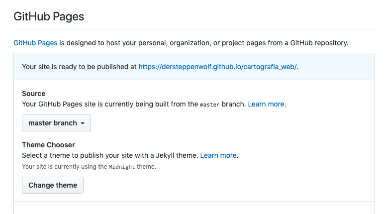

# Talleres y Tareas

- [Talleres y Tareas](#talleres-y-tareas)
  - [Nota](#nota)
  - [Taller 1 : Herramientas Colaborativas](#taller-1--herramientas-colaborativas)
    - [Docs: Versionamiento y Colaboración: Git y Github](#docs-versionamiento-y-colaboraci%C3%B3n-git-y-github)
    - [Docs: Markdown](#docs-markdown)
    - [Docs: Linter](#docs-linter)
    - [Docs: Ejemplos de presentación de repositorios en github](#docs-ejemplos-de-presentaci%C3%B3n-de-repositorios-en-github)
  - [Taller 2: Introducción a Qgis](#taller-2-introducci%C3%B3n-a-qgis)
    - [Objetivos](#objetivos)
    - [Ejercicio 1](#ejercicio-1)
      - [Docs: Tutoriales cartografía con SIG Desktop](#docs-tutoriales-cartograf%C3%ADa-con-sig-desktop)
      - [Fuentes de datos sugeridas](#fuentes-de-datos-sugeridas)
    - [Ejercicio 2: Creando mapas con Qgis2web y github pages](#ejercicio-2-creando-mapas-con-qgis2web-y-github-pages)
    - [GitHub Pages](#github-pages)
      - [Docs: QGIS2Web](#docs-qgis2web)
      - [Docs: Tecnologías web](#docs-tecnolog%C3%ADas-web)
      - [Docs: Qgis2threejs](#docs-qgis2threejs)
      - [Docs: GitHub Pages](#docs-github-pages)
  - [Taller 3: Servicios OGC](#taller-3-servicios-ogc)
  - [Taller 4: Publicando mapas utilizando herramientas disponibles en la nube](#taller-4-publicando-mapas-utilizando-herramientas-disponibles-en-la-nube)
  - [Taller 5: Using Python to Analyze Spatial Data](#taller-5-using-python-to-analyze-spatial-data)
  - [Taller 6: Ejemplos Python / Arcpy](#taller-6-ejemplos-python--arcpy)
  - [Taller 7: Desarrollo web con Leaflet y WMS](#taller-7-desarrollo-web-con-leaflet-y-wms)
  - [Tareas](#tareas)
    - [Tarea 1](#tarea-1)

## Nota

- Las tareas deben ser entregadas antes de la fecha máxima indicada.
- Las entrega tardía de tareas genera penalización en las notas

## Taller 1 : Herramientas Colaborativas

Parte 1:

- Instalar kahoot en sus dispositivos móviles https://kahoot.com/
- Cada persona debe crear una cuenta en github https://github.com/

- Crear un repositorio público personal (Licencia MIT / Creative Commons)
- Crear archivo **Readme.md** con la presentación. (Ejm: nombres, temáticas de interés, enlaces a trabajos personales, artículos, etc)
- Crear un issue en https://github.com/dersteppenwolf/cartografia_web/issues con lo siguiente:
  - Título: Taller 1 - CODIGO_ESTUDIANTE
  - Contenido: Enlace al repositorio creado

Parte 2:

- Instalar Github Desktop https://desktop.github.com/
- Crear el primer repositorio mediante GitHub Desktop https://help.github.com/es/desktop/getting-started-with-github-desktop/creating-your-first-repository-using-github-desktop
- Instalación y Uso de GitHub Desktop https://luismasdev.com/instalacion-y-uso-de-github-desktop/
- Tortoise git (https://carmoreno.github.io/tutoriales/2016/04/14/TortoiseGit-Instalacion-y-uso/) para sincronizar más fácilmente los archivos en github.

### Docs: Versionamiento y Colaboración: Git y Github

- Git and GitHub: A Guide for Beginners https://www.coursereport.com/blog/what-is-github
- Github hello world https://guides.github.com/activities/hello-world/
- Introducción a Git y Github https://desarrolloweb.com/articulos/introduccion-git-github.html
- Github: Hello world https://guides.github.com/activities/hello-world/
- An Intro to Git and GitHub for Beginners (Tutorial) https://product.hubspot.com/blog/git-and-github-tutorial-for-beginners
- Introducción al control de versiones con GitHub Desktop https://programminghistorian.org/es/lecciones/introduccion-control-versiones-github-desktop
- La comodidad de TortoiseGit, instalación y manejo http://carmoreno.github.io/tutoriales/2016/04/14/TortoiseGit-Instalacion-y-uso/
- Adding a file to a repository https://help.github.com/en/articles/adding-a-file-to-a-repository
- Getting Started with GitHub Pages https://guides.github.com/features/pages/

### Docs: Markdown

- Qué es Markdown, para qué sirve y cómo usarlo https://www.genbeta.com/guia-de-inicio/que-es-markdown-para-que-sirve-y-como-usarlo
- Markdown tutorial https://www.markdowntutorial.com/
- Qué es markdown https://markdown.es/
- Markdown Cheatsheet https://github.com/adam-p/markdown-here/wiki/Markdown-Cheatsheet
- Markdown quick reference cheat sheet https://en.support.wordpress.com/markdown-quick-reference/

### Docs: Linter

- Formatting Markdown and Codeblocks With Prettier and Hugo https://www.christopherbiscardi.com/post/formatting-markdown-and-codeblocks-with-prettier-and-hugo/

* Using Prettier with a Pre-commit Hook https://www.brianhan.co/prettier-with-a-pre-commit-hook

### Docs: Ejemplos de presentación de repositorios en github

- Explore Worldwide Female Educational Opportunities https://github.com/Divyaraaga/w209-datavis-project
- Visual analytics https://github.com/dersteppenwolf/isis4822
- Dashboard to analyze Rheumatoid Arthritis in Colombia based on Costs per Person https://github.com/dersteppenwolf/isis4822_final_project
- We know what you did - An analysis on Colombia congressman financial assests https://github.com/cjcarvajal/cuestion-publica-analysis
- How does Bogota vote? https://github.com/vgarzom/va-votacion-bogota

## Taller 2: Introducción a Qgis

### Objetivos

- Conocer el funcionamiento básico de QGIS
- Publicar mapas en la web con la ayuda de QGIS.

### Ejercicio 1

Conocer el funcionamiento básico de QGIS

#### Docs: Tutoriales cartografía con SIG Desktop

- QGIS Tutorials http://www.qgistutorials.com/en/index.html
- Thematic Maps using arcgis http://what-when-how.com/gis-and-spatial-analysis-for-the-social-sciences/thematic-maps-gis-and-spatial-analysis-part-1/
- A quick tour of displaying layers (Arcgis)
- Elements of a map https://www.gislounge.com/whats-in-a-map/
- Cartographic Tips For Creating Beautiful Maps With ArcMap https://alexurquhart.com/post/cartography-tips-arcmap/

#### Fuentes de datos sugeridas

- Natural Earth (Large scale data, 1:10m) http://www.naturalearthdata.com/downloads/
- Marco Geográfico Nacional (MGN) Dane 2017 - Colombia https://geoportal.dane.gov.co/
- World Borders http://thematicmapping.org/downloads/world_borders.php
- World Bank https://data.worldbank.org/
- World Bank Explorer http://data.un.org/Explorer.aspx
- Portal de datos abiertos de Colombia: datos.gov.co
- Portal de datos abiertos del IGAC: datos.igac.gov.co
- Openstreetmap (geofabrik) http://download.geofabrik.de/
- IDECA https://www.ideca.gov.co/datos-de-referencia
- Datos abiertos Bogotá http://datosabiertos.bogota.gov.co/

### Ejercicio 2: Creando mapas con Qgis2web y github pages

Qgis2web es una herramienta que exporta los proyectos de QGIS en mapas web de OpenLayers https://openlayers.org/ o Leaflet https://leafletjs.com/ (crea automáticamente los archivos HTML, Javascript y CSS).

La herramienta convierte las capas vectoriales en GeoJSON https://geojson.org/ y crea una estructura de carpetas con un archivo **index.html** que contiene el mapa web.

Además el plugin es capaz de exportar la simbología definida en QGIS tanto de puntos, líneas y polígonos e incluir un control de visibilidad de capas y varios controles más.

**Ejemplo**

- Página web: https://sigfedepanela.github.io/PreciosSemanales/
- Repositorio en github: https://github.com/sigfedepanela/PreciosSemanales
- Geojson generado por la herramienta: https://raw.githubusercontent.com/sigfedepanela/PreciosSemanales/gh-pages/layers/PreciosporDepartamento_2.js

### GitHub Pages

**GitHub Pages** es un sistema de publicación de contenido web a través de **GitHub**.

Con **GitHub Pages** es posible publicar de forma sencilla un sitio web con archivos almacenados en repositorios git. GitHub automáticamente se encarga de configurar y actualizar el servidor web correspondiente.

**Ejemplo**

- Url Página principal https://dersteppenwolf.github.io/cartografia_web/
- Mapa de ejemplo https://dersteppenwolf.github.io/cartografia_web/02_Servicios_Web_Geoservicios_OGC/ejemplo_qgis2web
- Código fuente generado https://github.com/dersteppenwolf/cartografia_web/tree/master/02_Servicios_Web_Geoservicios_OGC/ejemplo_qgis2web

#### Docs: QGIS2Web

- Web Mapping with QGIS2Web https://www.qgistutorials.com/en/docs/web_mapping_with_qgis2web.html
- Publica tus mapas en la web con qgis2web https://mappinggis.com/2016/03/crea-aplicaciones-webmapping-con-qgis/
- Qgis2web wiki https://github.com/tomchadwin/qgis2web/wiki

#### Docs: Tecnologías web

- HTML5 Tutorial https://www.w3schools.com/html/
- JavaScript Tutorial https://www.w3schools.com/js/default.asp
- CSS Tutorial https://www.w3schools.com/css/default.asp

#### Docs: Qgis2threejs

- [Qgis2threejs plugin documentation](https://qgis2threejs.readthedocs.io/en/docs/)
- [Tutorial](https://qgis2threejs.readthedocs.io/en/docs/Tutorial.html)

> Qgis2threejs plugin is a QGIS plugin, which visualizes DEM data and vector data in 3D on web browsers. You can build various kinds of 3D objects with simple settings panels, view them in web view of exporter and generate files to publish them to web in simple procedure. In addition, you can save the 3D model in glTF format for 3DCG or 3D printing.

#### Docs: GitHub Pages

- Getting Started with GitHub Pages https://guides.github.com/features/pages/
- Publicar tu web usando GitHub Pages https://devcode.la/tutoriales/publicar-tu-web-usando-github-pages/

## Taller 3: Servicios OGC

TODO

## Taller 4: Publicando mapas utilizando herramientas disponibles en la nube

- Ver https://github.com/dersteppenwolf/taller_gis_cloud
- Change a map's style https://docs.mapbox.com/mapbox-gl-js/example/setstyle/

## Taller 5: Using Python to Analyze Spatial Data

Ver https://github.com/dersteppenwolf/pycon

## Taller 6: Ejemplos Python / Arcpy

- Python variables y operaciones: https://gist.github.com/dersteppenwolf/fca39c1971fd0fd7c3ce
- Describir feature https://gist.github.com/dersteppenwolf/6dc546ef359ffbb85947
- Buffer https://gist.github.com/dersteppenwolf/82d65df9544933289bab
- Clip https://gist.github.com/dersteppenwolf/6dae5bfd9521db50e567

## Taller 7: Desarrollo web con Leaflet y WMS

- Utilizando WMS desde leaflet http://bl.ocks.org/hpfast/2155366c06f4ae0fae59df216fc3f7ec

## Tareas

### Tarea 1

**Fecha Máxima de entrega:** 2019-12-04 21:00

**Crear mapas temáticos con QGIS:**

- Utilizando Qgis cree un mapa temático (Sugerencia: datos de Colombia)
- Utilice dos métodos de clasificación diferentes
- Enriquezca el mapa con información de contexto (Ejm: Natural Earth)
- Publique los 2 mapas temáticos en QGIS Cloud
- Con datos diferentes Diseñe otro nuevo mapa temático con QGIS2Web y publiquelo uno de los mapas en Github Pages

**Publicar Resultados En el repositorio github personal creado:**

- Crear Archivo **Tarea1.md** con la siguiente información sobre los mapas que creó:
- Cuál es el problema a tratar?
- Por qué un mapa ayuda a resolverlo?
- Descripción del mapa temático (Variable seleccionada, utilidad)
- Descripción de los métodos de clasificación seleccionados. Cual es mejor para la variable seleccionada? Por qué?
- Listado de fuentes de datos seleccionadas (proveedor, enlace para descarga, descripciòn, procesamiento realizado)
- Descripción breve del procedimiento utilizado (plugins, extensiones, procesos, transformaciones de datos, etc)
- Ventajas / desventajas / dificultades / diferencias encontradas al utilizar QGIS para el desarrollo del ejercicio
- Proyecto qgis
- Urls de los mapas publicados en la web ya sea con Qgiscloud o QGIS2Web / Github Pages

**Enviar resultados para revisión:**

- Crear un issue en https://github.com/dersteppenwolf/cartografia_web/issues con lo siguiente:
  - Título: Tarea 1 - CODIGO_ESTUDIANTE
  - Contenido: Enlace al repositorio creado
